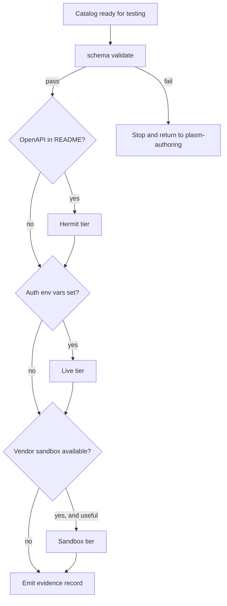

# Plasm Catalog End-to-End Testing

This skill is the **operational source of truth** for testing a Plasm catalog after authoring. It is intentionally explicit because validation passing is **not** the same as transport working. CGS / CML validation only proves internal consistency. The testing ladder below proves that the model actually moves bytes against a real wire shape, mock or otherwise.

## When to run

- Immediately after [plasm-authoring](../plasm-authoring/SKILL.md) writes or edits `domain.yaml` / `mappings.yaml`.
- After [plasm-catalog-polish](../plasm-catalog-polish/SKILL.md) makes structural changes.
- After [plasm-catalog-reprint](../plasm-catalog-reprint/SKILL.md) regenerates a catalog.
- Before [plasm-catalog-score](../plasm-catalog-score/SKILL.md) — the score depends on transport evidence, not just YAML hygiene.
- Whenever a catalog has not been transport-tested in its current shape and the user asks for confidence.

## Inputs

- `apis/<api>/` — the catalog directory.
- `apis/<api>/README.md` — required to discover:
  - OpenAPI spec path or URL (for Hermit)
  - Auth env vars (for live tests)
  - Vendor sandbox / test-mode URL or instructions (for sandbox tests)
  - Known limitations or risky write capabilities
- Optional: a user-provided OpenAPI path, sandbox URL, or live API key for this run.

## Required Evidence Per Run

Every run emits a short evidence record (in chat or in `apis/<api>/e2e/<timestamp>.md` when the user asks for durable artifacts) with:

- Catalog name and `domain.yaml` `version`
- Tier results: `hermit | live | sandbox | skipped` per tier
- Skip reasons (no spec, no credentials, vendor refuses sandbox, etc.)
- Representative Plasm expressions tried (copied from DOMAIN, not invented CLI flags)
- Decoded outcomes (row counts, first-row shape, first-row identity)
- Failures grouped by Plasm error (`CmlError::VariableNotFound`, `DecodeError`, HTTP status, auth failure)

## The Testing Ladder



## Tier 0: Validation Gate

Before any transport test runs, validate the catalog. Always pass the catalog **directory** so split `domain.yaml` + `mappings.yaml` load together.

```bash
cargo run -p plasm-cli --bin plasm -- schema validate apis/<api>
```

Failure means the catalog is malformed; return control to [plasm-authoring](../plasm-authoring/SKILL.md). Do not attempt transport tests on a broken CGS.

When an OpenAPI spec is available, also run the spec-driven mapping check (deterministic, no transport):

```bash
cargo run -p plasm-cli --bin plasm -- validate --schema apis/<api> --spec path/to/openapi.json
```

This catches missing capability mappings, body shape drift, and mismatched parameters against the spec — distinct from runtime checks.

## Tier 1: Hermit Mock

Hermit is a zero-config mock server that synthesizes responses from an OpenAPI spec. Use it **first** for any catalog whose source is OpenAPI (or whose README references an OpenAPI file). Hermit gives deterministic, free, fast transport coverage.

### When Hermit applies

- `apis/<api>/README.md` references an OpenAPI / Swagger file in `fixtures/real_openapi_specs/`, in the catalog directory, or by URL.
- The spec is reachable on disk or downloadable.
- The OpenAPI operations match the capabilities you authored.

If Hermit does **not** apply (no OpenAPI, GraphQL-only, vendor-private spec), record the reason and skip to Tier 2.

### Hermit run

```bash
# Start Hermit with `--use-examples` so the mock returns OpenAPI example payloads
hermit --specs path/to/openapi.json --port 9090 --use-examples
```

Then drive `plasm-repl` against the mock base URL. Confirm the base path by reading the spec's `servers` section — many specs use `/api/v3`, `/v2`, etc.

```bash
BASE=http://localhost:9090            # or http://localhost:9090/api/v3 etc.
cargo run -p plasm-repl -- --schema apis/<api> --backend "$BASE"
```

Inside the REPL, copy expression shapes from DOMAIN. Do **not** invent CLI flags.

```
:schema                                  # re-print DOMAIN for the catalog
:schema <EntityName>                     # focus one entity
<EntityName>                             # query-all when DOMAIN teaches it as bare
<EntityName>[field1, field2]             # query + projection
<EntityName>(<id>)                       # get by primary id when teaching is e#(<id>)
<EntityName>{p#=<value>, …}              # filtered query when DOMAIN teaches keyed params
<EntityName>(<id>).<relation>            # relation navigation
```

### What Hermit proves

- CML templates compile to legitimate URLs for each capability.
- Path / query / body variables bind correctly.
- Authentication injection does not break local mock calls (Hermit ignores credentials).
- Response decoders match OpenAPI example shapes (relations, projections, `path:` / `derive:` rules).
- Pagination wiring at least round-trips the first page.

### What Hermit does **not** prove

- Real vendor JSON shapes (examples often drift from production).
- Auth correctness (`401`, `403`).
- Rate limits, retry behavior, cursor exhaustion.
- Write effects (Hermit accepts POST/PUT/PATCH/DELETE but does not persist).

### Failure triage

| Symptom | Likely cause | Fix |
|---------|--------------|-----|
| `CmlError::VariableNotFound: <name>` | CML template variable does not match engine env | Fix `name:` in `mappings.yaml` (use `id`, the predicate field name, or `input`) |
| `DecodeError` on a known-good row shape | `path:` / `derive:` mismatch, missing `id_from`, or required field absent | Inspect the Hermit response JSON, adjust field wiring |
| `404` from Hermit | Base URL missing the server prefix from the spec | Update `--backend` to include the prefix |
| Empty relation rows | `materialize` path does not match parent GET response shape | Re-read the spec example for the parent and adjust |
| `validate --spec` complains about extra capabilities | The catalog defines capabilities that do not match any OpenAPI operation | Either the operation is missing from the spec (document why) or rename / remove the capability |

After fixing, return to [plasm-authoring](../plasm-authoring/SKILL.md) Step 4 and re-run validation, then re-enter this skill.

## Tier 2: Live API

Once Hermit (or, for non-OpenAPI catalogs, schema validation alone) is green, exercise the live API when credentials are available.

### When live tests apply

- The catalog's `auth:` env vars are set in the environment.
- The user has not asked to avoid network calls.
- The API is safe to read against at small volume.
- For write-capable catalogs, the user has explicitly authorized live writes, or you restrict live tests to read capabilities.

### Live run

```bash
cargo run -p plasm-repl -- --schema apis/<api> --backend https://api.example.com --mode live
```

Choose **read-only** capabilities for the first pass. Then exercise representative writes only if:

- The user has authorized them, AND
- There is a way to clean up (delete the created resource, or the API supports drafts / trash).

Use `--mode hybrid` to build a replay corpus on first contact; subsequent runs use `--mode replay` for deterministic regression.

### What live tests prove

- Real vendor JSON shapes match decoders.
- Auth scheme actually authenticates against the real server.
- Pagination over real result sets terminates and orders correctly.
- Rate limit / error responses are surfaced cleanly.
- Side-effect actions produce the side effect the `output.description` claims.

### Live test safety rules

- **Do not** call `delete` / `action` capabilities that touch shared production data unless the user specifically requests it.
- **Do not** commit secrets or `.env` files used for live runs.
- **Do** prefer test accounts, throwaway repositories, scratch workspaces.
- **Do** capture failures with the smallest reproducer Plasm expression.

If live access is unavailable, record the skip reason (no credentials, rate limit, vendor outage, account requires phone verification, etc.) and proceed to Tier 3.

## Tier 3: Vendor Sandbox / Test Mode

Many vendors expose sandbox or test-mode endpoints that allow safe writes against simulated state. These are the right tier for write-capable catalogs when live writes would be destructive.

### When sandbox tests apply

- The vendor publishes a sandbox or test-mode environment (e.g. Stripe test keys + `https://api.stripe.com` with `sk_test_*`, PayPal sandbox host, Plaid sandbox, Twilio test credentials, GitHub Apps using a throwaway repo, Discord developer test guild).
- The catalog README documents the sandbox URL or instructions, or the user supplies them.
- Live API testing alone is unsafe for the relevant write capabilities.

### Sandbox run

```bash
# Sandbox base URL replaces the live backend; auth env vars typically differ
PLASM_TEST_API_KEY="<sandbox-key>" \
cargo run -p plasm-repl -- --schema apis/<api> --backend https://sandbox.example.com --mode live
```

Exercise the same expression shapes as live tests, then add the writes that were intentionally skipped in Tier 2.

### What sandbox tests prove

- Writes (`create` / `update` / `delete` / `action`) round-trip end-to-end without touching production.
- Side-effect actions produce observable state changes that can be verified by a follow-up read.
- Authentication for the sandbox scheme works (often different from production auth).

### Sandbox skip reasons

- Vendor does not publish a sandbox.
- Sandbox requires manual signup / business verification that is outside this run.
- Sandbox semantics differ enough from production that confidence does not transfer (record the gap in evidence).

## GraphQL Catalogs

For catalogs with `transport: graphql`, Hermit is generally not applicable (Hermit reads OpenAPI). Use the same ladder with adjustments:

- Skip Tier 1 with reason "GraphQL catalog — no OpenAPI for Hermit".
- For Tier 2 / Tier 3, use the vendor's introspection-backed sandbox where available (e.g. `apis/linear`, `apis/graphqlzero`).
- `validate --spec` does not apply; rely on `schema validate` plus live / sandbox transport evidence.

## EVM and Other Non-HTTP Transports

For catalogs with EVM transports (`apis/evm-erc20` and similar):

- Skip Tier 1 with reason "non-HTTP transport".
- For Tier 2, point `--backend` at a public RPC endpoint (Cloudflare, public Alchemy / Infura keys).
- For Tier 3, use a local Anvil / Hardhat fork as the sandbox substitute.

## Evidence Template

Use this shape for the run record:

```
catalog: apis/<api>
version: <n>
date: <ISO8601>

tier 1 (hermit):
  status: <pass | fail | skipped>
  reason if skipped: ...
  spec: path/to/openapi.json
  expressions tried:
    - Pet                # query-all
    - Pet(10)            # get by id
    - Pet{status=available}
  decoded outcomes:
    - Pet rows: N
    - first row id: ...
  failures: ...

tier 2 (live):
  status: <pass | fail | skipped>
  reason if skipped: ...
  backend: https://api.example.com
  expressions tried: ...
  decoded outcomes: ...
  failures: ...

tier 3 (sandbox):
  status: <pass | fail | skipped>
  reason if skipped: ...
  backend: https://sandbox.example.com
  expressions tried: ...
  decoded outcomes: ...
  failures: ...

action items:
  - <ordered list of fixes for plasm-authoring or polish to address>
```

## Handoff

- If Tier 0 or Tier 1 fails, hand back to [plasm-authoring](../plasm-authoring/SKILL.md) with the failure summary.
- If Tier 2 / Tier 3 reveal decoder or shape drift, hand back to [plasm-catalog-polish](../plasm-catalog-polish/SKILL.md).
- If the catalog has been transport-validated, [plasm-catalog-score](../plasm-catalog-score/SKILL.md) can run.
- If the experience surfaced systemic gaps in Plasm itself (skill text, runtime expressiveness, fixtures, validators), record them for [plasm-catalog-retro](../plasm-catalog-retro/SKILL.md).
