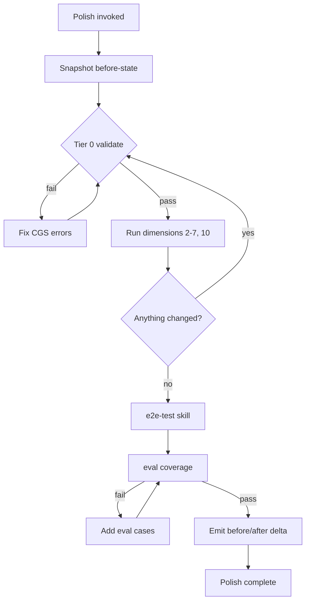

# Plasm Catalog Polish

This skill turns a "mostly authored" Plasm catalog into something publish-ready. It is **autonomous**: invoke it, let it run the diagnostic-fix-rediagnose loop, and read the delta at the end. It does not require human input between iterations except for blockers it cannot resolve (missing credentials, ambiguous semantic choices that require user judgement, or core Plasm gaps).

## When to run

- After [plasm-authoring](../plasm-authoring/SKILL.md) finishes a first pass on a new catalog.
- After [plasm-catalog-reprint](../plasm-catalog-reprint/SKILL.md) regenerates an existing catalog.
- On any existing `apis/<api>/` whose quality has drifted (descriptions, eval coverage, missing relations, typed-but-stringly fields).
- Before opening a publish PR.

## Inputs

- `apis/<api>/` — required.
- `apis/<api>/README.md` — read for auth env vars, OpenAPI path, sandbox info, intentional scope.
- Optional: a focus area provided by the user ("just descriptions", "just typing", "just evals"). If unset, polish runs the full audit.

## Audit Dimensions

Polish operates along these dimensions. Each has a clear gate and a clear fix path. The skill loops until every gate is green or a blocker is recorded.

### 1. CGS validation (gate)

```bash
cargo run -p plasm-cli --bin plasm -- schema validate apis/<api>
```

Any failure is a stop-the-loop blocker. Fix or report.

### 2. Mapping correctness against the spec (gate when spec exists)

```bash
cargo run -p plasm-cli --bin plasm -- validate --schema apis/<api> --spec path/to/openapi.json
```

Address every reported drift:

- Capabilities present in CGS but missing from mappings.
- Mapping params that do not appear in the OpenAPI operation.
- Body / query shape mismatches.

For GraphQL or non-OpenAPI catalogs, document the lack of spec validation in the run summary.

### 3. CGS field typing audit (fix-and-revalidate)

Read every entity and capability parameter. For each `value_ref` resolving to `string`, ask the strict typing checklist from [plasm-authoring SKILL.md](../plasm-authoring/SKILL.md):

- Should it be `date` + `value_format`?
- Should it be `select` / `multi_select` with `allowed_values`?
- Should it be `entity_ref` with `target:`?
- Should it be `blob`?
- Should it use a specific `string_semantics`?

Fix the `values:` row, then revalidate.

### 4. Relation completeness (fix-and-revalidate)

- Every `entity_ref` whose target is in the catalog should support FK navigation. Confirm the target has a `get` capability, or document why it does not.
- Every parent / child sub-resource URL should have a `materialize` block on the parent's `many` relation, using `query_scoped` or `query_scoped_bindings`.
- Self-referential `entity_ref` (parent / child trees) should be modeled if the API supports it.

### 5. Action output contracts (gate)

Every `kind: action` must declare:

- non-empty `provides:` (entity projection from response), **or**
- `output: { type: side_effect, description: "<domain effect>" }` (non-empty description, not "updates resource").

Validation will reject violations; this dimension reads them and fixes the descriptions or projection lists.

### 6. Description hygiene (fix-and-revalidate)

Audit entity `description`, capability `description`, and `output.description` for `side_effect` actions. Rewrite any string that:

- Contains an HTTP method, REST path, status code, or bare `http://` / `https://` URL (except `auth.token_url`).
- Names other capability ids ("call `foo_query` first").
- Inventories fields, relations, or projection contents that DOMAIN already prints.
- Uses tabular jargon ("row", "column") in domain-facing prose.
- Restates the wire type or enum members that `value_ref` already conveys.

See [plasm-authoring reference.md — DOMAIN-facing descriptions](../plasm-authoring/reference.md#domain-facing-descriptions-entities-and-capabilities).

### 7. Composed reads (`views:`) check

If the README, sample expressions, or eval cases imply a "snapshot" or "summary" entity that no single endpoint returns, ensure it is modeled as a `views:` composition rather than prose-only guidance. Canonical example: `apis/cloudflare` `SecurityOverview` + `views.security_overview`.

### 8. Transport evidence (gate via e2e-test skill)

Delegate to [plasm-catalog-e2e-test](../plasm-catalog-e2e-test/SKILL.md). At minimum, the catalog must pass:

- Tier 0 (validation).
- Tier 1 (Hermit) when an OpenAPI spec is available.
- Tier 2 (live) or Tier 3 (sandbox) when credentials exist.

If transport tests reveal decode failures, return to dimensions 3 / 4 / 6 above. Polish is the right home for those fixes.

### 9. Eval coverage (gate)

```bash
cargo run -p plasm-eval -- coverage --schema apis/<api> --cases apis/<api>/eval/cases.yaml
```

Fix missing buckets by adding eval cases — not by softening the coverage gate. Use the scaffold for hints:

```bash
cargo run -p plasm-eval -- scaffold --schema apis/<api>
```

If `eval/cases.yaml` does not exist, create it with `--write` and edit until coverage passes.

### 10. README sanity (fix)

`apis/<api>/README.md` should document:

- Capability count and scope summary.
- Auth env vars or `scheme: none` declaration.
- OpenAPI source path or URL when applicable.
- Sandbox / test-mode URL when applicable.
- Known limitations (write capabilities skipped, vendor quirks, rate-limit notes).

The skill updates the README when these are missing or stale.

## Loop



The loop keeps re-running validation after every structural change. It stops when one of the following is true:

- All dimensions are green.
- A blocker is recorded (missing credentials, ambiguous semantic choice, core Plasm gap).
- The user interrupts.

## Required Evidence

When polish completes, emit a delta record. Recommended shape:

```
catalog: apis/<api>
before:
  version: <n>
  schema validate: <pass | fail with N errors>
  validate --spec: <pass | fail | not applicable>
  typing audit: <N stringly fields downgraded to typed>
  description audit: <N descriptions rewritten>
  action output audit: <N actions fixed>
  views audit: <0 | N composed reads added>
  eval coverage: <pass | fail with missing buckets>
  hermit: <pass | fail | not applicable>
  live: <pass | fail | skipped>
  sandbox: <pass | fail | skipped>

after:
  version: <n+m>
  all dimensions: green
  notes:
    - any blockers
    - any user decisions needed
    - any candidates for plasm-catalog-retro

artifacts touched:
  apis/<api>/domain.yaml
  apis/<api>/mappings.yaml
  apis/<api>/eval/cases.yaml
  apis/<api>/README.md
```

## Handoff

- Successful polish → optional [plasm-catalog-score](../plasm-catalog-score/SKILL.md) to grade the catalog against the rubric.
- Systemic findings → [plasm-catalog-retro](../plasm-catalog-retro/SKILL.md).
- Polish revealed the model is fundamentally wrong → [plasm-catalog-reprint](../plasm-catalog-reprint/SKILL.md).

## What polish refuses to do

- Soften coverage requirements to make a catalog "pass".
- Paper over missing `output.description` on side-effect actions with generic phrases.
- Add API-specific runbooks to entity / capability descriptions.
- Modify `crates/plasm-core`, `crates/plasm-cml`, or `crates/plasm-runtime` to make a model fit. Core gaps go to a separate task.
- Generate `domain.yaml` mechanically from the spec.
