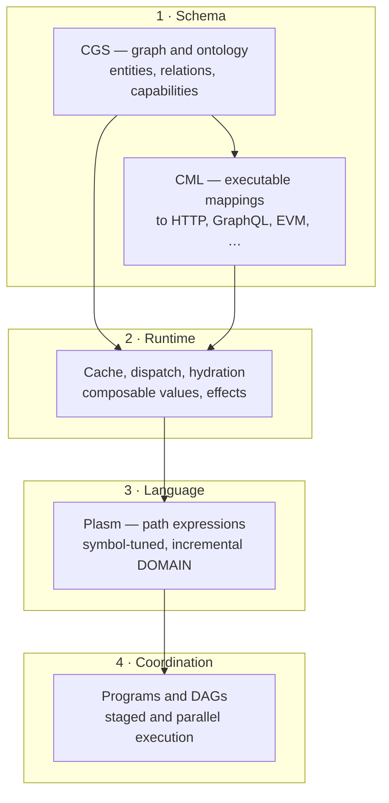
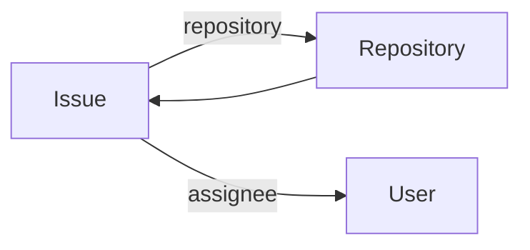
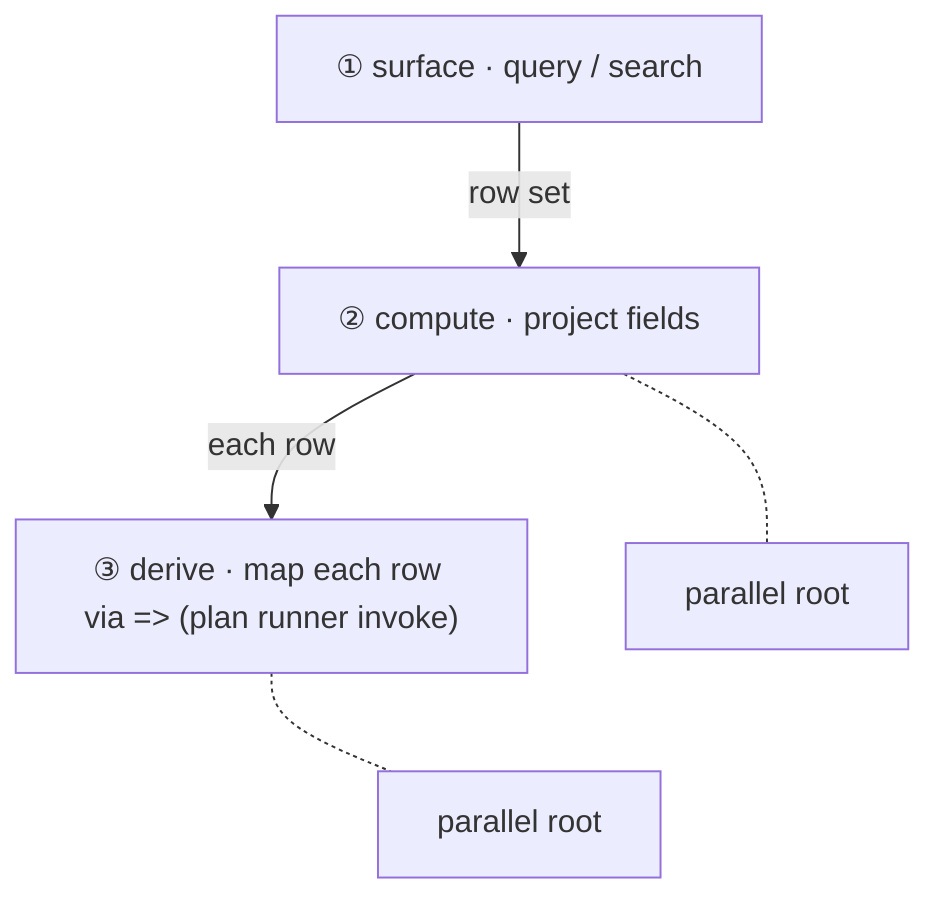
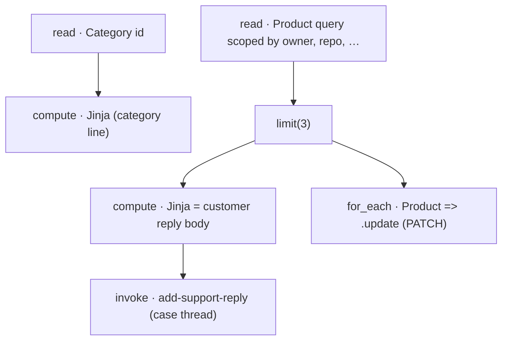

# Plasm — a unified language for federated API interaction

Agent stacks often hand the model a wall of JSON tools: many independent `inputSchema` blobs, no shared ontology, and repeated work when payloads are invalid. **Plasm** is a different bet: one **typed graph** of entities and capabilities (CGS), one **mapping and execution** layer to real transports (CML + runtime), one **surface language** the model learns from compact teaching tables (Plasm: `e#` / `m#` / `p#`), and one **planning and coordination** story (path expressions, multiline programs, and validated DAGs) for real multi-step work—**across API catalogs** without pretending unrelated vendors share one flat schema.

The subsections below are **ordered by dependency**: each layer assumes the previous is in place. Together they are why federation is not “more connectors in one MCP server,” but a **single language** with append-only, cross-catalog symbols and per-backend dispatch.

## How the abstractions stack



### 1. CGS and CML: graph, ontology, normalized capabilities

**Capability Graph Schema (CGS)** is the *domain* layer: **entities** (resources), **relations** (navigable edges, cardinalities), and **capabilities** (what the model may invoke). The graph is a compression of OpenAPI, GraphQL, or ABI ground truth. Capabilities are **normalized** into a small set of *families* so **get, list/query, full-text search, and writes** share the same **shape**—keyed args, entity refs, optional slots, and brace predicates—whether you are triaging an issue, paging a list, or opening a sub-issue. That sameness is what makes one prompt table teach many endpoints at once.

**Capability Mapping Language (CML)** is the *wire* layer: per-capability templates, auth, pagination, and decoding, so the abstract capability compiles to concrete transport calls without changing the agent-facing contract.

*Example — conceptual graph (one catalog):*



*Example (same capability family, different verbs—list vs search vs update):* the DOMAIN rows use one pattern for filters and refs; the model never learns a one-off JSON blob per REST path.

### 2. Runtime: what a real graph affords

The **runtime** turns capabilities into **lawful, composable results**: `Get` and `Query` and `Page` with stable refs; **projections** that select fields; **relations** scoped from a parent ref; **side effects** with explicit domain meaning. A **graph cache** holds materialized nodes; **hydration** completes projections; **paging** is a **handle** the runtime owns, not a cursor string the model must copy from headers. Effects compose with reads in predictable ways; where the graph allows, the host can **parallelize** independent work and **merge** in line order, or **stage** lines when the cache, writes, or ordering require it. One engine serves one-off expressions, many lines, and compiled program plans.

*Example (one line → one logical result; HTTP fan-out may be >1 under the hood):*

```plasm
e5{repository=e16(p217=plasm, p231=plasm), p34=open}
```

### 3. Plasm: symbol-tuned, incrementally defined grammar

**Plasm** is the **language** over the graph: path expressions with session-local `e#` / `m#` / `p#` for entities, methods, and fields, so the prompt stays small. Teaching tables are **incremental**—`discover_capabilities` and `plasm_context` add entities in waves; symbols are monotonic. The *grammar* is the same for GitHub, Slack, or a toy API: federation **adds seeds**; it does not fork the language.

*Example (read, then act, same token vocabulary):*

```plasm
e5(p304="acme", p319="purchasing", p297=42).m16(p47=1001)
e16(p304="acme", p319="purchasing")[p201,p190]
```

### 4. Programs, DAGs, and staged execution

**Multiline `plasm` programs** (bindings, bare final roots, or comma-separated roots) and **archived program plans** (typed `Plan` DAGs, dry-runs, approval policies) are how you coordinate **summarization, fan-out reads, dependent writes, and cross-entity workflows** without a second tool system. The host **stages** program lines when ordering matters and may **run parallel-fork** consecutive pure root queries. MCP passes a **program** string; HTTP may pass several **lines** in one `POST`—the same engine.

**Deferred planning, not a single undifferentiated tool call.** A composed program is **compiled** into a **validated, proof-bearing `Plan` DAG** (see [`plasm_dag.rs`](crates/plasm-agent-core/src/plasm_dag.rs) and the runner in [`plasm_plan_run.rs`](crates/plasm-agent-core/src/plasm_plan_run.rs)). The usual agent loop is **plan → review → edit or approve → run**: the host can return a **dry run** of that graph (node kinds, dependencies, and human-readable review text) *before* any live backend work, so the model (or a human) can **tighten queries, add limits, fix expressions**, and resubmit in the *same* Plasm surface using ordinary **correction and guidance**—rather than discarding a pile of one-off tool traces. In MCP, that split is the default **`execute: false`** path on the `plasm` tool (dry plan first; **`execute: true`** only after intent matches the plan). For **side effects and for-each stages**, the dry result carries **per-node `approval_gate` data** (policy key scoped by catalog, entity, and operation); the **phased** runner in [`plasm_agent_core::plasm_plan_run::run_plasm_plan`](crates/plasm-agent-core/src/plasm_plan_run.rs) walks nodes in order and can attach **host approval policy** to each mutating step, which is a better hook than a single all-or-nothing “tool” permission when the work spans reads, compute, and writes. The stock OSS default may **auto-approve** while a tenant-facing policy UI is added above that boundary, but the **gate and receipt shape** is already there for stricter runtimes.

*Example (three **lines** on the same surface—queries, then projection, then a mutation after cache-visible work):*

```plasm
e5{p39=e17(p304="plasm", p319="plasm"), p42="open"}, e5(p304="plasm", p319="plasm", p297=42)[p350,p237],e5(p304="plasm", p319="plasm", p297=42).m16(p47=123456)
```

*Example (**`plasm-dag`** multiline program—the host compiles it with [`compile_plasm_dag_to_plan` in `plasm_dag.rs`](crates/plasm-agent-core/src/plasm_dag.rs) into a typed `Plan` JSON artifact with `metadata: { "language": "plasm-dag" }` for the same runner; you author **bindings** and a **last line of bare roots**, not a hand-written plan):*

- One **`name = …`** per line. Valid RHS shapes include surface Plasm leaves, **`node.limit(n)`** / **`.sort`**, **`.[field,…]`** projection, **`node[field,…] <<TAG` … `TAG`** render (Jinja-style `{{ … }}` in the heredoc body, as in the `compiles_bound_query_limit_render_dag_to_valid_plan` unit test), **`source => { … }`** derive (plan values, **`_.field`** = current row in a map), and **`source =>` …** for-each side effects when the right-hand side is a Plasm **write** / **action** (line comments: `;;` to end-of-line). **Do not** prefix the final line with `return`—it is a syntax error.

The **compiled plan** chains **query → compute → derive**: each binding becomes a node—**surface Plasm** at the leaves (HTTP/query semantics), **compute** for projections and `limit`, and **`source => …`** for **derive** (object map from each row) or **for-each invokes** when the RHS is a mutation. Two **parallel** final roots return both `summary` (tabular) and `cards` (artifact).



```plasm
search = Product~"bolt hardware"
summary = search[id, name]
cards = summary => { blurb: { id: _.id, name: _.name } }
summary, cards
```

**Rich HTML / previews (Glass, Canvas, Markdown):** Plasm lines can contain **`<<TAG`** heredocs—those begin with **`<`**, which DOM/HTML parsers treat as markup so text after it may **vanish** (you often see a dangling `cards = summary `). **Always show programs as plain text:** `<pre>…</pre>`, `white-space: pre-wrap`, entity-escape `<`, or a code component that does **not** parse inner HTML. Arrows **`=>`** are safe; leading **`<<`** is not unless escaped.

*Larger program (helpdesk-style: **a customer-visible reply** plus a **back-end update**):* read a **Category** and a scoped **Product** list, **minijinja**-render a **public thread message** from the rows (the `brief` node is the **body** of what you would paste into ZenDesk, Intercom, or your own case UI), then **post** that text as a **`product_add_support_reply` action** on a designated “case” product id (`p-helpline-case-1` here—stand-in for the row your CRM uses for the ticket). The render’s `content` field is wired in with `message=brief.content`. Separately, `source => Product(_.id).update(…)` **repoints** each listed row’s `category_id` to the `bucket` you resolved—data-plane fix while the customer sees the reply. For-each vs surface invoke is the same `looks_like_plasm_effect_template` / side-effect path as in [`plasm_dag.rs`](crates/plasm-agent-core/src/plasm_dag.rs). The **last line** is **four** **parallel** roots: two digests, the **PATCH** stage, and the **thread comment**.



```plasm
bucket = Category("c1")
header = bucket[id, name] <<MD
# **{{ r.name }}** (`{{ r.id }}`)
MD
matches = Product{owner="acme", repo="ingest", active=true}
candidates = matches.limit(3)
brief = candidates[id, name, category_id] <<MD
Hi there — we’ve pulled **{{ rows | length }}** line item(s) in `acme/ingest` and matched them against the **category** we show in the other root. Here’s what we’re doing next:


- We’re reconciling **`{{ r.name }}`** (`{{ r.id }}`) to the category you asked us to use.


Thanks for your patience — the team
MD
synced = candidates => Product(_.id).update(category_id=bucket.id)
posted = Product("p-helpline-case-1").add-support-reply(message=brief.content)
header, brief, synced, posted
```

The fragment above is the **`scoped_create_tiny`** test fixture: same CGS with two entity types. In a **federated** execute session, `Category` and `Product` are often from **different** registry `entry_id`s; you still write one `plasm-dag` string—symbols resolve per exposure row as usual. The compiler test [`readme_plasm_dag_jinja_for_each_category_and_product_compiles`](crates/plasm-agent-core/src/plasm_dag.rs) locks this program. You can also wire **relation** follow-ups (e.g. from a `Product` get) as a separate binding on the right when the surface line parses in your session.

Surface and binding rules above are **ground truth** in [`plasm_dag.rs`](crates/plasm-agent-core/src/plasm_dag.rs) (`parse_statements`, `compile_node_expr`); the compiled `Plan` node array matches what you would get from a dry-run, not a separate ad hoc JSON shape.

*Dry-run header (illustrative—line counts and `execution` depend on node kinds):*

```text
plasm-program dry-run
name: product-brief
handle: p1 (plasm://session/s0/p/1)
nodes: 3 total, 1 read, 0 write/side-effect, 2 staged
execution: ordered (dependencies or non-root/staged nodes)
```

---

**Teaching table: verbatim `dump_prompt` (layers 1 and 3 in one catalog).** The **Expression** / **Meaning** lines below are **verbatim** `dump_prompt` output: an Issue-focused slice starting at the `p204` gloss row, then the `Repository` get and search rows from the same run (re-run the tool if you need an exact current snapshot; symbols drift when the schema changes):

```tsv
Expression	Meaning
p204	int · id
p214	int · number
p245	str · title
p176	markdown · body
p238	select · allowed: open, closed
p236	select · allowed: completed, reopened, not_planned, duplicate
p209	bool · locked
p177	date · closed_at
e5(p217=$, p231=$, p214=$)	returns e5 · projection [p204,p217,p231,p214,p245,p176,p238,p236,p209,p180,p186,p248,p177,p203] · A GitHub issue in a repository
e5(p217=$, p231=$, p214=$).m9()	returns () · Delete an issue (requires admin or sufficient repo permission).
e5(p217=$, p231=$, p214=$).m13()	returns e5 · optional params: p45, p39, p44, p43, p40, p38, p42, p41 · args: p45 title str opt; p39 body markdown opt; p44 state sel[open,closed] opt; p43 state_reason sel[completed,reopened,not_planned,duplicate] opt; p40 labels ref:e7 opt; p38 assignees array[ref:e18] opt; p42 milestone ref:e8 opt; p41 locked bool opt · Update an issue.
e5.m8(p25=e16(p217=$, p231=$), p26=$,..)	returns e5 · [scope p25→e16] · optional params: p22, p23, p21, p24 · args: p25 repository ref:e16 req; p26 title str req; p22 body markdown opt; p23 labels ref:e7 opt; p21 assignees array[ref:e18] opt; p24 milestone ref:e8 opt · Open a new issue in a repository.
e5{p31=e16(p217=$, p231=$), p34=$, p27=e18($), p29=$, p30=$, p32=$}	returns [e5] · optional params: p34, p27, p29, p30, p32 · args: p31 repository ref:e16 req; p34 state sel[open,closed] opt; p27 assignee ref:e18 opt; p29 labels ref:e7 opt; p30 milestone ref:e8 opt; p32 since date opt · List issues and pull requests in a repository (this list endpoint returns both types).
e5~$	returns [e5] · Search issues and pull requests globally. Prefix q with 'is:issue' to restrict to issues only.
e5(p217=$, p231=$, p214=$).p255	returns e18
e16(p217=$, p231=$)	returns e16 · projection [p204,p217,p231,p201,p190,p221,p200,p206,p235,p199,p215,p187,p172,p250,p186,p248,p228,p203] · A GitHub repository
e16~$	returns [e16] · Search GitHub repositories.
```

Method and query rows can include a compact `args: p# <wire> <type> <req|opt>; …` fragment in `Meaning` (and the same text in the `;;` tail for compact DOMAIN markdown). Example (same `dump_prompt` run):

```tsv
e19{p169=e16(p217=$, p231=$), p166=$, p167=$, p170=$, p165=e18($), p168=$}	returns [e19] · optional params: p166, p167, p170, p165, p168 · args: p169 repository ref:e16 req; p166 branch str opt; p167 event str opt; p170 status str opt; p165 actor ref:e18 opt; p168 head_sha str opt · List GitHub Actions workflow runs for a repository.
```

When a full `p#` row is needed (e.g. long `select+` / `array+` markers) or for projection, relations, and block headings, those lines appear separately. Details: [plasm-core: prompt surface](crates/plasm-core/README.md#prompt-surface).

So the model does not need to manufacture a REST payload for “list open bug issues in `plasm/plasm`”; it can emit the constrained Plasm form using the **wire names** and entity symbols from the prompt (here `e5` is `Issue` and `e16` is `Repository` in the same table as above):

```plasm
Issue{repository=Repository(owner=plasm, repo=plasm), state=open, labels=bug, sort=updated}
e5{repository=e16(p217=plasm, p231=plasm), state=open, labels=bug, sort=updated}
```

The parser is deliberately lenient here. The compact `e#` / `p#` symbols are session-local shadows over the canonical CGS names, so a model can also emit the readable form, or mix the two, and Plasm expands the symbols before parsing. For short scalar and select values, quotes can be elided too. The list-query row in the table is the same goal in symbolic form, e.g. `e5{p31=e16(p217=plasm, p231=plasm), p34=open, p29=bug, …}`.

### Auto-correction feedback

When a form still misses, Plasm gives the agent correction feedback in the same expression language instead of dumping a raw parser trace. Deterministic recovery can record a resolved form, but the feedback channel itself is imperative: it tells the model which expression shape to emit next, or asks it to choose when the runtime cannot safely guess.

Examples covered by the correction tests:

```text
Input:
Member{space_id=Space(555555555)}

Correction feedback:
`space_id` is not a valid filter name inside `Member{...}`.
Allowed parameter symbols include `team_id`, `list_id`, and `task_id`.
For example: `Member{team_id=...}` using a name from the allowed list.

Input:
Member{space_id=Space(555555555)}

Ambiguous recovery feedback:
`Member` must include exactly one scope in `{...}`: `team_id` -> `Team`, `list_id` -> `List`, `task_id` -> `Task`.
Pick one: Member{team_id=Team(id)} | Member{list_id=List(id)} | Member{task_id=Task(id)}
```

**Prompt size (default TSV teaching table).** The renderer’s stderr line reports character count, a **heuristic** token estimate (`chars / 4`, see [`plasm_core::PromptSurfaceStats`]), the **~N tools (DOMAIN)** line count (synthesized Plasm path-expression rows), and **schema** counts: **capabilities** in the surface slice plus **nav** (relation and entity-ref navigation edges—same graph as DOMAIN relation lines). Run from **`plasm-oss/`** (or use `apis/` if your repo links it to this tree). Discard stdout to see only that summary:

```text
cargo build -q -p plasm-core --bin dump_prompt
./target/debug/dump_prompt ./apis/github >/dev/null
# dump_prompt: prompt built — 24202 chars | ~6050 tok (heuristic) | ~118 tools (DOMAIN) | 91 caps + 28 nav (schema); writing stdout …
./target/debug/dump_prompt ./apis/clickup >/dev/null
# dump_prompt: prompt built — 18294 chars | ~4573 tok (heuristic) | ~109 tools (DOMAIN) | 85 caps + 11 nav (schema); writing stdout …
./target/debug/dump_prompt ./fixtures/schemas/overshow_tools >/dev/null
# dump_prompt: prompt built — 7401 chars | ~1850 tok (heuristic) | ~15 tools (DOMAIN) | 13 caps + 2 nav (schema); writing stdout …
```

Representative full-catalog runs (same as stderr above; `cwd` = `plasm-oss/`):

| Catalog (loaded CGS) | Prompt chars | ~Heuristic tokens (÷4) | ~DOMAIN tools (lines) | Capabilities (schema) | Nav / relations (schema) |
|----------------------|-------------:|------------------------:|----------------------:|------------------------:|---------------------------:|
| `apis/github` | 24,202 | 6,050 | 118 | 91 | 28 |
| `apis/clickup` | 18,294 | 4,573 | 109 | 85 | 11 |

For reference, the official `github-mcp-server` **v0.15.0** serialized `tools/list` surface is **64,129** characters (about **16,032** heuristic tokens by the same `÷4` rule) for **93** tool definitions—same order of comparison as the GitHub `apis/github` Plasm prompt row (**24,202** chars here), different artifact.

With more than one API in play, Plasm’s **intent-based catalog queries** (`discover_capabilities`) and **federated sessions** let the agent add only the relevant entities (GitHub, Linear, Slack, another catalog) and keep one typed symbol space—closer to a small query planner over API domains than a single fixed `tools/list`.

## Federation

Most MCP servers expose one fixed list of tools. Plasm exposes a catalog and lets the agent build a working set by intent.

The flow is:

```text
discover_capabilities("triage GitHub issues and notify Slack")
  -> candidate entities from github, slack, linear, ...
plasm_context(client_session_key="triage-window",
              seeds=[{ api: "github", entity: "Issue" },
                     { api: "github", entity: "PullRequest" },
                     { api: "slack",  entity: "Message" }])
  -> one session-local Plasm language
plasm([...])
  -> expressions over that shared symbol space
```

That session is **federated**, not flattened. Each catalog keeps its own CGS/CML graph and backend. The prompt renderer assigns append-only `e#`, `m#`, and `p#` symbols across everything the session has learned, while the runtime remembers which catalog owns each exposed entity and dispatches each expression to the right backend.

This gives agents a few useful properties:

- **Incremental context:** add GitHub issues first, then Slack messages later; existing symbols keep their meaning.
- **Intent-shaped prompts:** discover only the entities needed for the task instead of loading every tool from every integration.
- **Typed boundaries:** a GitHub `Issue`, Linear `Issue`, and Slack `Message` can coexist without pretending their schemas merged.
- **Planner-like execution:** the model works over a typed graph of capabilities, refs, projections, pages, and side effects; Plasm handles transport dispatch and result normalization underneath.

The important constraint is that federation does **not** magically join unrelated APIs by shared field names. Cross-API workflows are composed by the agent and runtime over typed refs and returned values; each API catalog remains independently authored, validated, and executed.

**Program plans (archived DAGs, dry-runs, `pN` handles, trace provenance)** use the *same* CGS/CML boundary and runtime as one-line `plasm` calls (see [section 4 — Programs, DAGs, and staged execution](#4-programs-dags-and-staged-execution) above). The host may require **dry review** before mutating plan nodes, attach **approval gates** to side-effect classes, and record **provenance** (`plasm://execute/.../plan/...`, trace rows) without introducing a second tool system.

## Normalized results

This is the same **composable value** story as [section 2 — Runtime: what a real graph affords](#2-runtime-what-a-real-graph-affords) in concreter form. APIs do not agree on result shape. One endpoint returns a bare array, another wraps rows under `items`, another hides the next page in a cursor URL, and writes may return a resource, a status body, or nothing useful. Plasm normalizes those differences into a small monadic return value the agent can reason about: one expression in, one typed value out, with *projections*, refs, paging, and side effects represented consistently.

One expression does **not** always mean one HTTP request. The expression is the semantic unit; the runtime may fan it out into the calls needed to satisfy it: relation traversal, scoped child queries, implicit get-after-query hydration, projection hydration, pagination, or cache reads. The agent still gets one normalized value or table back, plus execution stats showing how many backend calls were made.

```text
expr -> Value<T>

Entity get        -> Ref<Entity> + projected fields
Entity query      -> Page<Entity> + stable refs + next-page handle
Projection        -> Value<{ selected fields only }>
Relation          -> query scoped by the parent ref
Create/update     -> Ref<Entity> + fields provided by the response
Side effect       -> Unit, with the declared domain effect
```

The model asks for the shape it needs, not the vendor's transport envelope. A projection is explicit:

```plasm
e5(p304="plasm", p319="plasm", p297=42)[p350,p336]
```

In REPL table mode, the same normalization is visible without squinting at JSON. This command:

```bash
printf ':output table\nAbilityScore("str")[name,full_name]\nAbilityScore{}\n:quit\n' | \
  cargo run -q -p plasm-repl -- \
    --schema apis/dnd5e --backend https://www.dnd5eapi.co \
    --focus AbilityScore --output table
```

returns a projected monadic value as a tiny table:

```text
plasm> AbilityScore("str")[name,full_name]
→ Get(AbilityScore:str)
  projection: [name, full_name]
name  full_name
----  ---------
STR   Strength

(1 result, Live, 516ms, 1 http call)
```

and a list expression as normalized entity rows:

```text
plasm> AbilityScore{}
→ Query(AbilityScore all) cap=ability_score_query
index  name  full_name  desc
-----  ----  ---------  ----------------------------------------------------------------
cha    CHA
con    CON
dex    DEX
int    INT
str    STR   Strength   [Strength measures bodily power, athletic training, ...]
wis    WIS

(6 results, Live, 176ms, 1 http call)
```

On a richer endpoint, the same table may be the result of many backend calls. For example, a paginated Pokémon query hydrates the 20 returned refs into full rows:

```text
plasm> Pokemon{}
→ Query(Pokemon all) cap=pokemon_query
id  name        base_experience  height  is_default  order  weight  species
--  ----------  ---------------  ------  ----------  -----  ------  ----------
1   bulbasaur   64               7       true        1      69      bulbasaur
2   ivysaur     142              10      true        2      130     ivysaur
3   venusaur    236              20      true        3      1000    venusaur
4   charmander  62               6       true        5      85      charmander
...

(20 results, Live, 1147ms, 21 http calls)
```

That is the point: the model asked for `Pokemon{}`; Plasm handled the index call plus hydration calls and returned a single table.

The first column is the stable ref key for follow-up work. The runtime keeps the full entity ref (`AbilityScore("str")`, or for GitHub `Issue(owner="plasm", repo="plasm", number=42)`) even when the table only displays selected columns.

That lets a later expression mutate or traverse by ref instead of rebuilding a raw API payload:

```plasm
e5(p304="plasm", p319="plasm", p297=42).m16(p47=123456)
```

Here the sub-issue mutation is declared as a side effect. The useful result is not a guessed JSON body; it is the fact that the issue graph changed in a typed way.

For markdown, HTML, document, JSON-text, or blob-like inputs, Plasm uses tagged heredocs instead of asking the model to escape a large string. For example, the GitHub issue-comment capability has a markdown body slot, so the expression can carry multiline markdown directly:

````plasm
e6.m21(p10=e17(p304="plasm", p319="plasm"), p9=42, p8=<<MD
## Triage note

- reproduced on main
- needs a regression test

```rust
fn smoke() {}
```
MD
)
````

The delimiter (`MD` here) is chosen by the model, and the body is passed as the value for that one typed markdown parameter. No JSON string escaping or ad hoc newline convention is required. Tagged heredocs are also already familiar to base models because the same pattern is ubiquitous in bash, shell scripts, CI config, and ops docs.

In standard MCP / JSON-schema tools, the same payload sits inside a JSON argument object. The MCP spec's `tools/call` request is shaped like `{"params":{"name":"...","arguments":{...}}}`, and each tool advertises an `inputSchema` as JSON Schema. JSON then imposes its own string rules: RFC 8259 says quotation marks, backslashes, and control characters like raw newlines must be escaped.

So the equivalent tool call becomes something closer to:

```json
{
  "jsonrpc": "2.0",
  "method": "tools/call",
  "params": {
    "name": "create_issue_comment",
    "arguments": {
      "owner": "plasm",
      "repo": "plasm",
      "issue_number": 42,
      "body": "## Triage note\n\n- reproduced on main\n- needs a regression test\n\n```rust\nfn smoke() {}\n```"
    }
  }
}
```

That is valid JSON, but it is also a bad surface for models and humans: the markdown is no longer markdown-shaped, every newline is an escape sequence, embedded code fences live inside a quoted string, and another layer of shell or SDK serialization can double-encode the whole thing. This is not hypothetical; public MCP/agent bug reports include JSON arguments being treated as literal strings, JSON arguments being double-encoded into a string key, Windows shell quoting breaking JSON parsing, and OpenAI-style function-call argument strings being parsed twice and corrupting escape sequences.

### Paging and Archive Refs

Paging is built in. If a query mapping declares pagination, Plasm owns the continuation handle instead of making the model inspect `next`, `cursor`, `page`, or `Link` headers by hand:

```plasm
e5{p39=e17(p304="plasm", p319="plasm"), p42="open"}
page(pg1)
```

Large or lossy-presented results get the same treatment. Instead of stuffing every long field into the chat turn, Plasm can return resource refs for run snapshots: canonical `plasm://execute/{prompt_hash}/{session_id}/run/{run_id}` URIs and short `plasm://r/{n}` or `plasm://session/{sN}/r/{n}` handles for MCP `resources/read`. Trace records carry a stable `RunArtifactArchiveRef` (`prompt_hash`, `session_id`, `run_id`, optional `resource_index`) so the full archived result can be fetched later even when the table says `(in artifact)`.

The same normalization applies across catalogs in a federated session: refs remain typed, page handles remain runtime-owned, archive refs point to complete run snapshots, and projections stay attached to the entity that knows how to hydrate them.

### Program inputs (HTTP vs MCP)

Each call executes a **Plasm program**—the grammar is the same; only how you pass it changes. The MCP **`plasm`** tool has one required JSON field **`program`**: a string that may be a **single** `plasm_expr`, a **full** `plasm_program` (bindings, transforms, then bare final roots, often multiline, including a real DAG if the host compiles a plan), or one line of **comma-separated** parallel roots. **HTTP** `POST /execute` accepts a body as **one or more line-separated Plasm program fragments** (newlines in `text/plain`, a JSON `lines` array, or a top-level JSON string array). That is the same program surface with a **line** as the unit of staging (dependency-sensitive steps stay in order; parallel-safe pure root queries can fork–merge in one request). A composed **`plasm_program` in one string** is a different way to hand the same engine a multi-node program, not a separate “mode.” Both routes use the same engine.

Example: HTTP body with a `lines` array (one string per **step**):

```json
{
  "lines": [
    "e5{p39=e17(p304=\"plasm\", p319=\"plasm\"), p42=\"open\"}",
    "e12{p137=e17(p304=\"plasm\", p319=\"plasm\"), p139=\"open\"}",
    "e18{p163=e17(p304=\"plasm\", p319=\"plasm\")}"
  ]
}
```

The result is still one normalized response, but it is organized by step:

```text
# Plasm run

## Step 1 of 3
`e5{...}`
→ Query(Issue ...)
...

## Step 2 of 3
`e12{...}`
→ Query(PullRequest ...)
...

## Step 3 of 3
`e18{...}`
→ Query(RepositoryTag ...)
...
```

The host does not treat this as a dumb loop: it **stages** the lines it receives.

- Consecutive root `Query` expressions without top-level projection enrichment can run in a parallel (fork–merge) stage.
- The parallel stage forks the session graph, runs those branches concurrently, then merges in line order.
- Gets, writes, page continuations, projections, relation traversals that need cache state, and side effects run as sequential barriers.
- Each step still records its own run artifact, request fingerprints, paging hints, omitted fields, and trace metadata.

An agent can therefore issue several cache-independent reads in one `plasm` or HTTP `POST` while still preserving order where the graph or effects require it. Example lines:

```plasm
e5{p39=e17(p304="plasm", p319="plasm"), p42="open"}
e5(p304="plasm", p319="plasm", p297=42)[p350,p237]
e5(p304="plasm", p319="plasm", p297=42).m16(p47=123456)
```

The first line can be scheduled with adjacent pure queries. The projection line may hydrate fields from the graph, and the mutation line is a side effect, so those are executed after prior cache-visible work. A single request is capped at 64 such lines.

## Dynamic CLI

The same CGS/CML catalog also compiles into a normal command-line interface. There is no handwritten GitHub CLI shim hiding underneath: entity names, path parameters, query filters, relation subcommands, write operations, enum validation, and pagination flags are generated from the schema.

For a tiny public catalog:

```bash
cargo run -q -p plasm-agent --bin plasm-cgs -- \
  --schema apis/dnd5e --backend https://www.dnd5eapi.co \
  abilityscore --help
```

prints:

```text
Operations on AbilityScore resources

Usage: plasm-cgs abilityscore [id] [COMMAND]

Commands:
  query   Query AbilityScore resources
  skills  AbilityScore -> Skill (many)
  help    Print this message or the help of the given subcommand(s)

Arguments:
  [id]  AbilityScore ID — get by ID, or follow with a subcommand
```

That is the same domain model as the Plasm prompt: `abilityscore str` is a get, `abilityscore query` is a collection query, and `abilityscore str skills` is relation traversal through the typed graph.

On a larger catalog, the generated CLI stays structured instead of becoming a bag of flat RPC names. The GitHub issue surface now includes reads, relations, writes, and curated actions:

```text
Usage: plasm-cgs issue --owner <owner> --repo <repo> [id] [COMMAND]

Commands:
  search                  Search Issue by relevance
  query                   issue_query (scoped query)
  sub-issue-query         issue_sub_issue_query (scoped query)
  user                    Issue -> User (one)
  assignee                Issue -> User (one)
  milestone               Issue -> Milestone (one)
  issue-type              Issue -> IssueType (one)
  labels                  Issue -> Label (many)
  sub-issues              Issue -> Issue (many)
  create                  Create a new Issue
  update                  issue_update
  delete                  Delete a Issue
  sub-issue-add           issue_sub_issue_add
  sub-issue-remove        issue_sub_issue_remove
  sub-issue-reprioritize  issue_sub_issue_reprioritize
  assignees-add           issue_assignees_add
  assignees-remove        issue_assignees_remove
  assign-copilot          issue_assign_copilot
```

Filters and pagination are typed too:

```text
Options:
  --state <state>             [possible values: open, closed, all]
  --sort <sort>               [possible values: created, updated, comments]
  --direction <direction>     [possible values: asc, desc]
  --limit <pagination_limit>  Maximum entities to return
  --all                       Fetch all pages
  --page <pagination_page>    Starting `page` query parameter
```

So the same authored API model gives an agent prompt, a REPL, an MCP surface, and a human-debuggable CLI. When a capability changes in `domain.yaml`, the prompt contract and CLI move together.

## Authoring APIs with agents

Adding a new API catalog is a semi-autonomous authoring process. Plasm does not treat OpenAPI as a correct-by-construction generator target; an agent still has to decide the domain model: which resources become entities, which endpoints collapse into one capability, which fields are refs, where pagination lives, and which operations are side effects.

The repository includes local guidance for Cursor, Claude, Codex, and other coding agents:

```text
AGENTS.md
CLAUDE.md
.cursor/agents/plasm-api-mapping-designer.md
.cursor/skills/plasm-authoring/SKILL.md
.cursor/skills/plasm-authoring/reference.md
```

The intended loop is:

```text
read spec/docs -> design entity graph -> author domain.yaml -> author mappings.yaml
-> compile/validate -> test against Hermit mocks -> add eval cases -> iterate
```

The compiler validates the authored model and transport templates:

```bash
cargo run -p plasm-cli -- schema validate apis/<api>/domain.yaml
cargo run -p plasm-cli -- validate --schema apis/<api> --spec path/to/openapi.json
```

Hermit gives you a local mock server from the same OpenAPI spec, so the generated CLI can be exercised before live credentials or write endpoints are involved:

```bash
hermit --specs path/to/openapi.json --port 9090 --use-examples
cargo run -p plasm-agent --bin plasm-cgs -- \
  --schema apis/<api> --backend http://localhost:9090 <entity> query
```

Finally, `plasm-eval` checks model conformance: natural-language goals in `apis/<api>/eval/cases.yaml` must cover the expression forms and entities the catalog exposes.

```bash
cargo run -p plasm-eval -- coverage \
  --schema apis/<api> --cases apis/<api>/eval/cases.yaml
```

That makes API authoring agent-friendly without pretending the semantic reduction from vendor RPCs to CGS is automatic.

This repository contains the same stack as the [introduction](#how-the-abstractions-stack) above, shipped as crates:

- **`plasm-core`**: CGS, prompt rendering, path parsing and Plasm type-checking over the graph.
- **`plasm-cml` / `plasm-compile`**: CML (mappings) and compile-time checks from authored catalogs.
- **`plasm-runtime`**: execute graph cache, transport dispatch, hydration, effects.
- **`plasm-agent` / `plasm-mcp` (HTTP)**: execute sessions, discovery, traces, and MCP for agents.

This workspace ships `plasm-agent` and `plasm-mcp` for local use: HTTP discovery, execute sessions, and unauthenticated Streamable HTTP MCP. The sections below target this workspace only.

## API catalog

The `apis/` directory contains curated CGS/CML packages you can load directly with `--schema apis/<name>` or pack into plugin catalogs with `plasm-pack-plugins`.

Catalogs are independent of transport. The same CGS entity/capability model can compile through REST/HTTP, GraphQL-over-HTTP, EVM reads, or future transports added to CML without changing the agent-facing expression layer.

| API                                      | What it covers                                                                                |
| ---------------------------------------- | --------------------------------------------------------------------------------------------- |
| [clickup](apis/clickup/)                 | ClickUp workspaces, tasks, lists, and related project-management objects                      |
| [discord](apis/discord/)                 | Discord guild/channel/message style API surface                                               |
| [dnd5e](apis/dnd5e/)                     | D&D 5e SRD public API                                                                         |
| [evm-erc20](apis/evm-erc20/)             | EVM ERC-20 reads                                                                              |
| [figma](apis/figma/)                     | Figma API surface                                                                             |
| [github](apis/github/)                   | GitHub repositories, issues, sub-issues, issue types, PRs, reviews, Actions, files, and users |
| [gitlab](apis/gitlab/)                   | GitLab projects, issues, and merge requests                                                   |
| [gmail](apis/gmail/)                     | Gmail mailbox operations                                                                      |
| [google-calendar](apis/google-calendar/) | Google Calendar events and calendars                                                          |
| [google-docs](apis/google-docs/)         | Google Docs get/create/batch update operations                                                |
| [google-drive](apis/google-drive/)       | Google Drive files, sharing, comments, drives, and changes                                    |
| [google-sheets](apis/google-sheets/)     | Google Sheets values, batches, and metadata                                                   |
| [graphqlzero](apis/graphqlzero/)         | GraphQLZero / JSONPlaceholder-style GraphQL                                                   |
| [hackernews](apis/hackernews/)           | Hacker News Firebase and Algolia search                                                       |
| [jira](apis/jira/)                       | Jira Cloud REST                                                                               |
| [linkedin](apis/linkedin/)               | LinkedIn profile and posting/query surfaces                                                   |
| [linear](apis/linear/)                   | Linear GraphQL issues and comments                                                            |
| [microsoft-teams](apis/microsoft-teams/) | Microsoft Teams via Microsoft Graph                                                           |
| [musixmatch](apis/musixmatch/)           | Musixmatch lyrics and related entities                                                        |
| [notion](apis/notion/)                   | Notion bearer-auth reads/search and database rows                                             |
| [nytimes](apis/nytimes/)                 | New York Times developer APIs                                                                 |
| [omdb](apis/omdb/)                       | OMDb movie data                                                                               |
| [openbrewerydb](apis/openbrewerydb/)     | Open Brewery DB                                                                               |
| [openmeteo](apis/openmeteo/)             | Open-Meteo weather                                                                            |
| [outlook](apis/outlook/)                 | Outlook mail folders, messages, and attachments                                               |
| [pokeapi](apis/pokeapi/)                 | PokéAPI full surface                                                                          |
| [rawg](apis/rawg/)                       | RAWG games                                                                                    |
| [reddit](apis/reddit/)                   | Reddit OAuth identity, subreddits, posts, comments, and search                                |
| [rickandmorty](apis/rickandmorty/)       | Rick and Morty API                                                                            |
| [slack](apis/slack/)                     | Slack Web API                                                                                 |
| [spotify](apis/spotify/)                 | Spotify Web API                                                                               |
| [tau2_retail](apis/tau2_retail/)         | Tau2 retail test domain                                                                       |
| [tavily](apis/tavily/)                   | Tavily search, extract, and research                                                          |
| [themealdb](apis/themealdb/)             | TheMealDB                                                                                     |
| [twitter](apis/twitter/)                 | X API v2 posts, users, lists, and OAuth scope map                                             |
| [vultr](apis/vultr/)                     | Vultr public HTTP v2                                                                          |
| [xkcd](apis/xkcd/)                       | xkcd JSON API                                                                                 |


## Prerequisites

- **Rust** (stable), **Cargo**
- A shell with **environment variables** available to the `cargo run` process (and optionally a `**.env`** file in the working tree or a parent—see [dotenv handling](crates/plasm-agent-core/src/dotenv_safe.rs) used by `plasm_agent::init_agent_runtime`).

All commands assume the current directory is the root of this repository.

## Build

**Agent and CLI (`plasm-mcp`, `plasm-cgs`, `plasm-pack-plugins`)** — no codegen step:

```bash
cargo build -p plasm-agent
```

**Full workspace** (includes crates that do not all need to be on the critical path for MCP):

```bash
cargo build --workspace
```

`**plasm-repl**` depends on `[plasm-eval](crates/plasm-eval)`, which includes a **generated** Rust `baml_client` (gitignored). With `[baml-cli](https://github.com/BoundaryML/baml)` on your `PATH` and a version compatible with `[baml_src/](baml_src/)`, run from this directory:

```bash
baml-cli generate
cargo build -p plasm-repl
```

If this repository is checked out as the `plasm-oss/` subdirectory of the full Plasm monorepo, you can run `scripts/ci/ensure-baml-codegen.sh` from the monorepo root; it pins a `baml-cli` version to match CI. Until codegen succeeds, use `**cargo build -p plasm-agent**` only; the quickstarts below list `plasm-repl` where a REPL is optional.

## Configuration (`.env` and environment)

**Default:** put values in a `**.env`** file at the workspace root (or a parent—`[dotenv_safe](crates/plasm-agent-core/src/dotenv_safe.rs)` walks up and merges) or `export` them in your shell. `plasm_agent::init_agent_runtime` loads dotenv on startup (see [lib.rs](crates/plasm-agent/src/lib.rs)).

- **Outbound API calls** (Vultr, Spotify, etc.) use CGS `auth: …` with `**env:`** and OAuth `**client_*_env`** in `[apis/](apis)*`—that reads `**std::env`** (including from `.env`). Avoid `hosted_kv` in local development here; that path targets platform KV in the hosted product.
- `**plasm-mcp` from this workspace** does **not** start `auth-framework`, does not require `PLASM_AUTH_JWT_SECRET`, and runs Streamable HTTP MCP **without** API-key or OAuth **transport** auth. Use `**plasm-mcp-app`** in the monorepo for tenant-scoped MCP, API keys, and control-plane features.
- **Operations / Kubernetes** may still use `PLASM_SECRETS_DIR` and the bootstrap materializer in `[bootstrap_secrets](crates/plasm-agent-core/src/bootstrap_secrets.rs)` for the **product** image—see deploy docs in the private repo—not the default path for day-to-day work in this tree.

## Quickstart: public API (no third-party secrets)

The `[apis/dnd5e](apis/dnd5e)` schema uses `auth: none` and a public `http_backend` in `[domain.yaml](apis/dnd5e/domain.yaml)`. No API keys are required to try read-only calls.

**Interactive REPL:**

```bash
cargo run -p plasm-repl -- --schema apis/dnd5e --backend https://www.dnd5eapi.co
```

**MCP + HTTP in one process:** no JWT or bootstrap flags:

```bash
cargo run -p plasm-agent --bin plasm-mcp -- \
  --schema apis/dnd5e --http --port 3000
```

Add `--mcp` for Streamable HTTP MCP on the same process (see `plasm-mcp --help` for `port` / `mcp-port` when using both).

**Non-interactive check** (only needs `plasm-cgs`, not `plasm-repl` or BAML):

```bash
cargo run -p plasm-agent --bin plasm-cgs -- --schema apis/dnd5e --backend https://www.dnd5eapi.co \
  abilityscore str
```

## Quickstart: API key and OAuth (outbound env vars)

These show **two** common patterns. Export the variables (or add them to `.env`), then run against the matching `apis/…` tree.

**Bearer / API key** — [Vultr](apis/vultr) declares `bearer_token` with `env: VULTR_API_KEY` in `[domain.yaml](apis/vultr/domain.yaml)`.

```bash
export VULTR_API_KEY="your-vultr-key"

cargo run -p plasm-agent --bin plasm-cgs -- --schema apis/vultr --backend https://api.vultr.com \
  region query --limit 5
```

**OAuth 2.0 client credentials** — [Spotify](apis/spotify) uses `oauth2_client_credentials` with env-backed client id/secret in `[domain.yaml](apis/spotify/domain.yaml)` (`SPOTIFY_CLIENT_ID`, `SPOTIFY_CLIENT_SECRET`).

```bash
export SPOTIFY_CLIENT_ID="…"
export SPOTIFY_CLIENT_SECRET="…"

cargo run -p plasm-repl -- --schema apis/spotify --backend https://api.spotify.com
```

`**plasm-mcp` with the same catalog:** the process still needs no `PLASM_AUTH_JWT_SECRET`; set only the outbound env vars (and optional `.env`).

## Add Plasm to Claude, Cursor, or another MCP client

Run `plasm-mcp` as a local Streamable HTTP MCP server, then point your client at its `/mcp` endpoint.

For a public API:

```bash
cargo run -p plasm-agent --bin plasm-mcp -- \
  --schema apis/dnd5e --backend https://www.dnd5eapi.co --mcp --port 3001
```

For an authenticated API, put the outbound credentials in `.env` or export them before starting the server:

```bash
export VULTR_API_KEY="your-vultr-key"

cargo run -p plasm-agent --bin plasm-mcp -- \
  --schema apis/vultr --backend https://api.vultr.com --mcp --port 3001
```

Then configure your MCP client:

```json
{
  "mcpServers": {
    "plasm": {
      "url": "http://127.0.0.1:3001/mcp"
    }
  }
}
```

Use the same URL in Claude Desktop, Cursor, or any client that supports Streamable HTTP MCP. This local server does not require an MCP transport API key; provider credentials are only for outbound calls to the API catalog you loaded.

## Roadmap

The current system proves a narrow thing: a typed domain model can compile into a compact prompt language, a parser, runtime validation, a CLI, HTTP execution, MCP tools, paging, refs, traces, and correction feedback. The next research direction is to apply that compiler shape beyond ordinary API connectors.

### Instance Languages

Plasm catalogs are currently written for API domains like GitHub, D&D 5e, Spotify, EVM ERC-20 contracts, and GraphQL-backed services. The same idea should apply to **instance languages**: a grammar compiled for one concrete spreadsheet, database schema, warehouse model, or project workspace.

Instead of teaching a model generic SQL or vague spreadsheet instructions, a catalog could expose the actual tables, sheets, ranges, columns, joins, constraints, and allowed mutations for that instance:

```plasm
Invoice{status=overdue, customer=Customer(name=acme)}
SheetRow{sheet=Q2Forecast, region=emea, confidence<0.7}[owner,next_action]
```

The evidence is already in the shape of CGS: entities, fields, relations, typed filters, projections, and scoped queries are not inherently HTTP-specific. CML currently maps those forms to HTTP, GraphQL, and EVM-style transports; more execution targets can be added underneath the same prompt contract.

### Prompt-Native Plasm

MCP is a useful transport, but it is not the essence of Plasm. The compact `dump_prompt` surface, REPL, parser, type checker, and correction loop already exist independently of MCP. A future mode could use Plasm more like BAML: compile a task-specific prompt contract, ask the model to emit Plasm directly, parse/type-check the response, and execute or validate it without wrapping the interaction in MCP tool calls.

That path should be more efficient for workflows where the model only needs a grammar and a validator, not a networked tool registry. MCP can remain one delivery mechanism; Plasm can also be a prompt-native language for structured model output.

### Bidirectional Agent Communication

Today the language is mostly used for tool invocation: model emits expression, runtime returns normalized value, page, ref, side effect, artifact, or correction feedback. That is already more like a typed dialogue than a one-shot function call.

A future direction is to use Plasm for **bidirectional agentic communication**: typed requests, replies, delegations, review comments, commitments, and handoff artifacts between agents. The same pieces that make tool calls tractable also matter there: compact symbols, declared domain semantics, projections, refs to archived context, and correction feedback when a message does not match the shared contract.

## License

Plasm is licensed under the [Business Source License 1.1](LICENSE). The Change
License is Apache License 2.0 on the Change Date stated in the license.