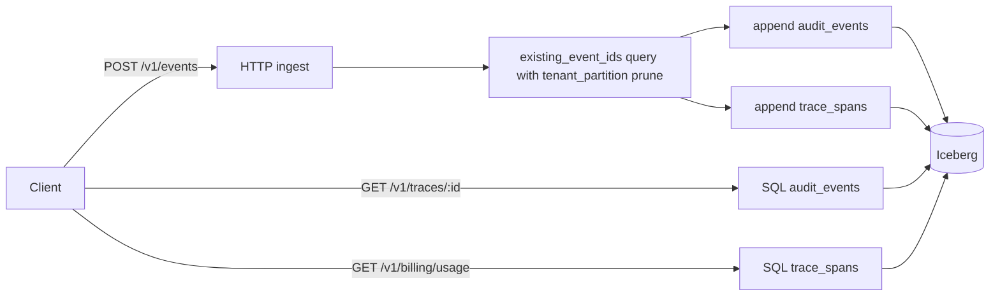

# plasm-trace-sink

**Product / operated boundary:** this binary is **optional** for the open-source executor (`plasm-mcp` works without `PLASM_TRACE_SINK_URL`). It **requires PostgreSQL** (Iceberg SqlCatalog) and a warehouse; that makes it **SaaS- or ops-tier infrastructure** in the architecture sense — same family as production Helm and durable observability — even though the crate may ship from the [plasm-core](https://github.com/ryan-s-roberts/plasm-core) workspace for build convenience. It is **not** a route inside `plasm-saas` (a separate long-running process). See [oss-saas-boundary in the product monorepo](https://github.com/ryan-s-roberts/plasm/blob/main/docs/oss-saas-boundary.md) (path may move as the repo split matures).

HTTP service that ingests **Plasm audit events** and persists **all** read/write state in **Apache Iceberg** tables (Parquet data files + JDBC SqlCatalog metadata). There is **no in-process** deduplication buffer, trace index, or billing cache: **`GET /v1/traces/{id}`** and **`GET /v1/billing/usage`** query Iceberg via **DataFusion** after each startup.

It is the sink behind `PLASM_TRACE_SINK_URL` when `plasm-mcp` (or other clients) POST audit batches after MCP / HTTP execute work (canonical trace rows use `event_kind` = `mcp_trace_segment`).

## Design boundary: no domain leakage

Plasm is a **general-purpose language and runtime for API mapping** (schema, expressions, CML, execution). **Domain-specific knowledge is forbidden in this crate:** no branches on particular CGS entity or capability names from `apis/…`, no field-alias or env-key hacks for one vendor’s HTTP templates, and no special transport cases tied to a single product.

Catalog behavior belongs in **`apis/<name>/`**, fixtures, and optional **plugins**—expressed as data and schema-driven rules. Code here stays **agnostic**, driven only by loaded CGS and generic IR/types.

---

## Role in the Plasm stack

| Concern | Where it lives |
|--------|----------------|
| Emitting events | `plasm-mcp` (and similar) configured with `PLASM_TRACE_SINK_URL` |
| Ingest + Iceberg reads/writes | **this crate** (`plasm-trace-sink` binary) |
| Local dev orchestration | `just local-web` → `scripts/local-dev-web.sh` (builds, starts sink on `7070`) |
| Postgres catalog for dev | `scripts/export-plasm-trace-sink-catalog.sh` (sourced by `local-dev-web`; schema `plasm_iceberg_catalog` on `plasm_web_dev`) |

---

## Architecture (logical)



1. **HTTP layer** (`http.rs`): JSON ingest, health, trace read, billing usage query.
2. **Application state** (`state.rs`): Thin wrapper over [`AuditSpanStore`](src/append_port.rs) (`AuditSpanWriter` + `AuditSpanReader`) — **strict idempotency** on `event_id` via an Iceberg `SELECT ... WHERE event_id IN (...)` on `audit_events`, with **`AND tenant_partition IN (...)`** derived from the batch (when within cap) so scans prune partitions; in-batch duplicate IDs are skipped.
3. **Domain types** (`model.rs`): `AuditEvent` (ingest envelope), `TraceSpanRow` (denormalized span for billing/UI).
4. **Projection** (`projector.rs`): Derives billable `TraceSpanRow` rows from `mcp_trace_segment` events whose payload deserializes to a `plasm_line` segment of the canonical `plasm-trace` `TraceEvent` JSON.
5. **Storage** (`iceberg_writer.rs`, `append_port.rs`): [`IcebergSink`](src/iceberg_writer.rs) implements [`AuditSpanWriter`](src/append_port.rs) and [`AuditSpanReader`](src/append_port.rs) (and thus [`AuditSpanStore`](src/append_port.rs)) — append batches and DataFusion SQL for reads.

The **binary** (`main.rs`) resolves startup via [`Config::iceberg_connect_params`](src/config.rs) into [`IcebergConnectParams`](src/config.rs) (`CatalogConnectionString` + [`WarehouseLocation`](src/config.rs)), calls [`IcebergSink::connect`](src/iceberg_writer.rs) with `&params`, and logs the catalog with [`CatalogConnectionString::redacted_for_logs`](src/config.rs). If SqlCatalog or table init fails, the process exits.

---

## Data flow: ingest

1. **POST `/v1/events`** accepts `{"events": [AuditEvent, ...]}`.
2. **In-batch dedupe**: duplicate `event_id` in one payload increments `duplicate_skipped` and is not sent to Iceberg.
3. **Historical dedupe**: `SELECT event_id ... WHERE event_id IN (...)` against `audit_events`, plus **partition filter** on distinct `tenant_partition` values from the batch (capped); already-known IDs increment `duplicate_skipped`.
4. **Append**: Remaining events → `append_audit_events`; projected spans → `append_trace_spans`.
5. If an append fails after dedupe, errors are logged; operators should retry (idempotency still holds for already-written `event_id`s).

---

## Iceberg layout (JanKaul stack)

The implementation uses **[JanKaul `iceberg-rust`](https://github.com/JanKaul/iceberg-rust)**:

- **`iceberg-sql-catalog`**: Metadata in **PostgreSQL** via `PLASM_TRACE_SINK_CATALOG_URL` (required at startup).
- **`datafusion` + `datafusion_iceberg`**: Appends and **reads** via `SessionContext::sql`.
- **Object store**: Default **local** Parquet under `PLASM_TRACE_SINK_WAREHOUSE_PATH` (JanKaul `ObjectStoreBuilder::Filesystem`). If **`PLASM_TRACE_SINK_WAREHOUSE_URL`** is set (non-empty) to `s3://` or `s3a://`, **Parquet data files** use **S3-compatible** storage (`ObjectStoreBuilder::s3`, `AmazonS3Builder::from_env`). SqlCatalog **metadata** stays in **Postgres** via `PLASM_TRACE_SINK_CATALOG_URL` — not in the bucket.

### Catalog naming

- SqlCatalog warehouse name aligns with DataFusion registration (`warehouse`).
- Namespace: **`plasm`**.
- Tables: **`audit_events`**, **`trace_spans`** (identifiers `warehouse.plasm.audit_events`, etc.).

### Partitioning (current)

- **Audit**: identity on **`tenant_partition`**.
- **Trace**: identity on **`tenant_partition`**.

### Schema alignment

Each table has parallel representations: **Serde** (`model`), **Iceberg** (`IcebergSchema` in `iceberg_writer.rs`), and **Arrow** (batch writers + decoders). Adding a column requires updating all three.

---

## HTTP API (summary)

| Method | Path | Purpose |
|--------|------|---------|
| GET | `/v1/health` | Liveness (`ok`) |
| POST | `/v1/events` | Batch ingest; `{ "accepted", "duplicate_skipped" }` |
| GET | `/v1/traces/{trace_id}` | Audit events for a trace from **Iceberg** (404 if none), sorted |
| GET | `/v1/billing/usage?from=&to=` (RFC3339) | Optional `tenant_id`; billing spans from **Iceberg** |

Reads **survive process restart** as long as the catalog URL and warehouse location (filesystem path or `s3://` base) point at the same data.

---

## Configuration

| Variable | Default / notes |
|----------|------------------|
| `PLASM_TRACE_SINK_LISTEN` | `127.0.0.1:7070` |
| `PLASM_TRACE_SINK_DATA_DIR` | `var/plasm-trace-sink` |
| `PLASM_TRACE_SINK_WAREHOUSE_PATH` | `{data_dir}/iceberg_warehouse`. Used for Parquet files **only** when `PLASM_TRACE_SINK_WAREHOUSE_URL` is unset or empty. |
| `PLASM_TRACE_SINK_WAREHOUSE_URL` | If set (non-empty after trim), **S3-compatible** warehouse base, e.g. `s3://bucket/prefix` — parsed by [`S3WarehouseUri::parse`](src/config.rs) (normalized to `s3://…`). **Takes precedence over `PLASM_TRACE_SINK_WAREHOUSE_PATH`** for Iceberg data files (path is ignored; no warning). Requires `AWS_ACCESS_KEY_ID`, `AWS_SECRET_ACCESS_KEY`, and for Vultr-style endpoints `AWS_ENDPOINT_URL` / `AWS_REGION` (see [object_store S3](https://docs.rs/object_store)). |
| `PLASM_TRACE_SINK_CATALOG_URL` | **Required.** SqlCatalog JDBC URL to Postgres (`postgresql://` or `postgres://`, e.g. with `search_path` for metadata schema). |
| `PLASM_TRACE_SINK_ICEBERG` | **Deprecated.** Setting to `0` / `false` / `no` **exits** at startup (there is no in-memory mode). |

CLI: `--listen` overrides `PLASM_TRACE_SINK_LISTEN`.

Logging: `RUST_LOG` (e.g. `info`, `plasm_trace_sink=debug`). JDBC catalog URLs use [`CatalogConnectionString::redacted_for_logs`](src/config.rs) at startup (userinfo masked for `postgresql://` / `postgres://`).

---

## Local development

From the repo root (see also [`docs/local-ux-dev.md`](../../docs/local-ux-dev.md)):

```bash
just local-web
```

To point the catalog at the same Postgres as Phoenix, ensure Docker `plasm_web_postgres` is running and that `scripts/local-dev-web.sh` sources `export-plasm-trace-sink-catalog.sh`, which sets `PLASM_TRACE_SINK_CATALOG_URL` with `search_path=plasm_iceberg_catalog,public`.

---

## Building and testing

```bash
cargo build -p plasm-trace-sink
cargo test -p plasm-trace-sink
```

HTTP integration tests require **Postgres** for SqlCatalog: either **Docker** (testcontainers) or set **`PLASM_TRACE_SINK_TEST_CATALOG_URL`** to an empty database. If neither is available, those tests exit early without failing.

Docker image (from repo root):

```bash
# From repository root — full graph (same as CI / just build):
TAG=local-dev IMAGE_PREFIX=localhost:5001 bash scripts/docker/bake-images.sh push

# Single target only:
docker buildx build -f docker/plasm-stack.Dockerfile --target plasm-trace-sink-runtime -t plasm-trace-sink:local .
```

---

## Crate map

| Module | Responsibility |
|--------|----------------|
| `config` | Env-based `Config`; `iceberg_connect_params()` → [`IcebergConnectParams`](src/config.rs); `resolved_catalog_url()` → `Result<String, anyhow::Error>`; [`S3WarehouseUri`](src/config.rs); `ensure_iceberg_not_disabled()` |
| `http` | Axum router, CORS, request handlers |
| `state` | `AppState`, strict Iceberg-backed `ingest_batch` |
| `model` | `AuditEvent`, `TraceSpanRow`, request/response DTOs |
| `projector` | Event → span rows |
| `append_port` | `AuditSpanWriter`, `AuditSpanReader`, marker `AuditSpanStore` |
| `iceberg_writer` | `IcebergSink`: SqlCatalog, append, SQL reads, Arrow decode |

---

## Dependencies (high level)

- **HTTP**: `axum`, `tower-http`, `tokio`
- **Iceberg**: `iceberg-rust`, `iceberg-sql-catalog`, `datafusion`, `datafusion_iceberg`, `object_store`

Pinned versions live in `Cargo.toml` / workspace `Cargo.lock`; the Iceberg crates track the JanKaul git revision.

---

## Operational notes

- **Credentials**: Catalog URLs may contain passwords; prefer env vars and redacted logging for Postgres.
- **Disk**: Warehouse directory must be writable; metadata grows with snapshots/commits.
- **Scaling**: Single process; no built-in HA. Multiple instances need non-colliding writes or external routing.
- **Strict dedupe**: Each ingest batch runs an existence query; very large batches may need chunking in a future revision. Batches with more than **64** distinct `tenant_partition` values skip the partition filter and fall back to a wider scan (see [`IcebergSink::EXISTING_EVENT_IDS_PARTITION_FILTER_CAP`](src/iceberg_writer.rs)).
- **Billing query**: `GET /v1/billing/usage` reads all rows from `trace_spans` via DataFusion and applies tenant, time window, and `is_billing_event` in process. SQL predicate pushdown against this Iceberg table was observed to return empty results intermittently; the in-memory filter keeps results correct at the cost of scanning the full table (acceptable for current single-node / dev scale).

### Profiling ingest and manifest churn

Repeated `get_manifest` / metadata work in profiles usually scales with **how many manifest files** the current table snapshot references (Iceberg reads manifest list → each manifest → data files). That is expected for scans; the ingest path runs **several** Iceberg operations per batch (idempotency scan, two append commits for audit + trace spans, load latest trace heads, append trace heads).

- **Structured timings**: set `RUST_LOG=plasm_trace_sink::ingest_timing=info` to emit `phase` + `elapsed_ms` per step (`existing_event_ids`, `append_audit_trace`, `load_latest_trace_heads`, `append_trace_heads`, and an outer `update_trace_heads`).
- **Tracing spans**: at `debug` or your APM exporter, look for `plasm_trace_sink.ingest.*` spans to split flame graphs by phase.
- **Manifest / file counts**: use Iceberg tooling (Spark procedures, PyIceberg, `metadata.json` under the warehouse) to inspect snapshot summary statistics and **data file** / **manifest** counts when diagnosing hot paths.

### Compaction and snapshot hygiene

Sustained append-only ingest increases small files and manifest fan-out. For production deployments:

- Run periodic **Iceberg maintenance**: rewrite data files / **compaction** (see [Iceberg Table maintenance](https://iceberg.apache.org/docs/latest/maintenance/)) so scans and commits stay bounded.
- Configure **snapshot expiration** and optional orphan file cleanup per your retention policy.

### Optional: external idempotency index (future)

If Iceberg idempotency scans are still too expensive at scale, a common pattern is a small **indexed store** (e.g. Postgres table or Redis set) keyed by `event_id` for O(1) existence checks, with Iceberg remaining the durable audit log. That path is **not** implemented in this crate; it would be an architectural add-on in front of `existing_event_ids`.

---

## See also

- [`docs/local-ux-dev.md`](../../docs/local-ux-dev.md) — ports, env vars, `just local-web`
- [`scripts/export-plasm-trace-sink-catalog.sh`](../../scripts/export-plasm-trace-sink-catalog.sh) — Postgres catalog wiring
- [`AGENTS.md`](../../AGENTS.md) — repository-wide agent / trace sink mentions
