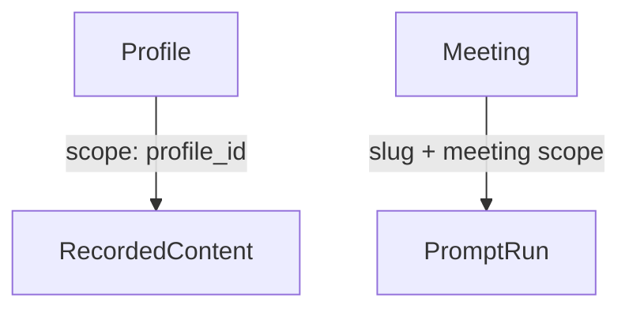

# Overshow → Plasm-flavoured grammar and prompt examples

This file implements the **Overshow → Plasm** teaching artifact: symbol-tuned grammar, copy-paste goal lines, and `e#` / `m#` / `p#` exemplars. It is meant for system prompts, tool descriptions, or DOMAIN-adjacent teaching.

**Living schema:** The canonical CGS for this slice lives in [`domain.yaml`](domain.yaml) with stub [`mappings.yaml`](mappings.yaml). The machine-generated **DOMAIN** string (TSV) is [`domain_prompt.txt`](domain_prompt.txt), produced by:

```bash
cargo build -p plasm-core --bin dump_prompt
./target/debug/dump_prompt fixtures/schemas/overshow_tools > fixtures/schemas/overshow_tools/domain_prompt.txt
```

**Vocabulary:** Plasm uses **CGS** (domain model) + **CML** (HTTP wiring). “CGL” is not a separate artifact name.

---

## 1. Symbol-tuned grammar (compact)

### 1.1 Entity nouns (PascalCase, stable across prompts)

Use these **singular** domain nouns; agents should not mix synonyms (avoid “recording”, “clip”, “hit” interchangeably—pick one column name per concept).

| Symbol | Meaning |
|--------|---------|
| `RecordedContent` | A row from full-text or profile-scoped **content** search (OCR, transcript, UI text). |
| `Profile` | A resolved person / organisation / project. |
| `DetectedQuestion` | A question extracted from screen/audio with optional candidate answers. |
| `Meeting` | A detected meeting; primary key in prompts is **`meeting_uuid`** (UUID string). |
| `CaptureItem` | One pipeline item (UI frame, OCR chunk, audio segment, document chunk); identity is **`id` + `content_type`**. |
| `PipelineSnapshot` | One **read-only** status blob (queues, embeddings coverage, last activity). Not a stream. |
| `CaptureSession` | Whether capture is running or paused (singleton “state”, not a list). |
| `PipelineEvent` | One in-memory bus event (severity-filtered). |
| `PromptRun` | Outcome of **`run-action-prompt`** (create/job semantics—slug + optional meeting scope). |

### 1.2 Operation shapes (verb + object)

Teach agents this **pattern language** (maps to Plasm `kind` mentally: search / query / get / singleton get / create).

| Pattern | When to use | Example stem |
|---------|-------------|----------------|
| **`RecordedContent.search(q, …)`** | Free-text relevance over captured text. | “Search what appeared on screen or was said…” |
| **`RecordedContent.query_by_profile(profile_id, …)`** | Must scope to one **Profile** first. | “What did we discuss with [profile]?” |
| **`DetectedQuestion.query(…)`** | Filter questions / answers; optional pagination. | “Unresolved questions in Slack…” |
| **`Meeting.query(…)`** | List meetings by status or date window. | “Ended meetings last week…” |
| **`Meeting.get(meeting_uuid)`** | Full narrative + attendees + action items. | “Summarise meeting `uuid`…” |
| **`PromptRun.create(slug, …)`** | Run an action prompt (single meeting, multi-meeting, or time range). | “TL;DR across meetings 1–3” / “Catch me up for Tuesday…” |
| **`Profile.query(…)`** | Discover **`profile_id`** for scoped search. | “List person-type profiles…” |
| **`Profile.get(id)`** | Drill into topics / facts / history. | “Detail for profile 42…” |
| **`PipelineSnapshot` (singleton)** | One-shot health: queues, embeddings, activity clocks. | “Is the pipeline backed up?” |
| **`CaptureItem.query(…)`** | Recent items (preview list). | “Last 20 captures from Zoom…” |
| **`CaptureItem.get(id, content_type)`** | Debug one item (stage, errors). | “Why isn’t item 9911 embedded?” |
| **`CaptureSession` (singleton)** | Running vs paused. | “Is capture on?” |
| **`PipelineEvent.query(…)`** | Live-ish bus tail (names/sources CSV, severity floor). | “Show critical embedding_worker events…” |

### 1.3 Enum tokens (must match wire)

Agents must **not** paraphrase these—paste exact tokens in user-facing filters:

- **Content / search:** `all` | `ocr` | `audio` | `ui`
- **Profile type:** `person` | `organisation` | `project` (UK spelling **organisation** if that is the API)
- **Search-by-profile mode:** `auto` | `keyword` | `natural`
- **Meeting status:** `active` | `ended` | `cancelled`
- **Capture item type (detail):** `ui` | `ocr` | `audio` | `document`
- **Event severity floor:** `debug` | `info` | `warning` | `error` | `critical`

### 1.4 Parameter naming (snake_case, aligned with JSON Schema)

Keep **the same names** as your tool input schema in prose templates: `q`, `query`, `profile_id`, `meeting_uuid`, `meeting_ids`, `start_time`, `end_time`, `content_type`, `min_severity`, `names`, `sources`, etc. That reduces translation bugs between “prompt English” and tool JSON.

---

## 2. Prompt example set (copy-paste blocks)

Each line is a **goal-style** instruction an operator might send; they are tuned to the grammar above.

### 2.1 Recorded content

- “Use **`RecordedContent.search`** with **`q`** = `quarterly revenue` and **`content_type`** = `audio`, **`limit`** 25.”
- “**`RecordedContent.search`**: **`q`** = `error: ECONNRESET`, window **`app_name`** = `Terminal`, between **`start_time`** and **`end_time`** (RFC3339).”
- “**`RecordedContent.query_by_profile`**: **`profile_id`** = `7`, **`query`** = `Sarah`, **`mode`** = `natural`.”

### 2.2 Questions and meetings

- “**`DetectedQuestion.query`**: **`unresolved_only`** true, **`app_name`** = `Slack`, **`include_answers`** true, **`min_answer_similarity`** 0.6.”
- “**`Meeting.query`**: **`status`** = `ended`, **`start_date`** / **`end_date`** ISO8601 date window.”
- “**`Meeting.get`**: **`meeting_uuid`** = `<uuid>` — return narrative and action items.”

### 2.3 Prompts and profiles

- “**`PromptRun.create`**: **`slug`** = `write-tldr`, **`meeting_uuid`** = `<uuid>`.”
- “**`PromptRun.create`**: **`slug`** = `list-action-items`, **`meeting_ids`** = `[101, 102]`, **`start_time`** / **`end_time`** for the week.”
- “**`Profile.query`**: **`profile_type`** = `person`, **`limit`** 50 — then **`Profile.get`** the best match.”

### 2.4 Pipeline and capture

- “Fetch **`PipelineSnapshot`** (singleton): report queue depths and embedding coverage.”
- “**`CaptureItem.query`**: **`limit`** 50, **`app_name`** = `Google Chrome`, after **`start_time`**.”
- “**`CaptureItem.get`**: **`id`** = `9911`, **`content_type`** = `ocr` — show stage and errors.”
- “Read **`CaptureSession`** (singleton): is capture running?”

### 2.5 Events

- “**`PipelineEvent.query`**: **`names`** = `ocr_result,transcription`, **`min_severity`** = `warning`, **`limit`** 100.”

---

## 3. Scope note

This document is **pedagogy** for agents. The validated split schema (`domain.yaml` + `mappings.yaml`) in this directory is the **machine contract**; regenerate [`domain_prompt.txt`](domain_prompt.txt) after CGS changes so `e#` / `m#` / `p#` rows stay aligned.

---

## 4. Relation sketch (teaching only)



This preserves the **Profile → scoped content** and **Meeting → prompt run** story without fixing HTTP paths.

---

## 5. `e#` / `m#` / `p#` expression exemplars (Plasm micro-syntax)

Opaque **`e#`** (entity), **`m#`** (capability / dotted method), and **`p#`** (field or parameter) glosses are assigned **monotonically** in a session; DOMAIN shows the map. [§5.2](#52-illustrative-entity-anchor-e--noun) uses **fixed illustrative** indices for teaching without implying a particular session—**real** prompts use the table in [`domain_prompt.txt`](domain_prompt.txt).

### 5.1 Illustrative entity anchor (`e#` → noun)

| Token | Entity |
|-------|--------|
| `e0` | `RecordedContent` |
| `e1` | `Profile` |
| `e2` | `DetectedQuestion` |
| `e3` | `Meeting` |
| `e4` | `CaptureItem` |
| `e5` | `PipelineSnapshot` |
| `e6` | `CaptureSession` |
| `e7` | `PipelineEvent` |
| `e8` | `PromptRun` |

### 5.2 Core expression forms (after expansion `e#` → entity name)

- **Get (scalar id):** `e3("550e8400-e29b-41d4-a716-446655440000")` → `Meeting("…")`
- **Get (compound key):** `e4(id=9911, content_type=ocr)` → `CaptureItem(…)`
- **Search (primary text param):** `e0~"quarterly revenue"` → `RecordedContent~"…"` (binds the search / `q`-role field)
- **Query (predicates):** `e2{unresolved_only=true, app_name="Slack"}` → `DetectedQuestion{…}`
- **Query (scoped):** `e0{profile_id=e1(7), query="Sarah"}` — cross-entity refs use **`e1(7)`** inside predicates when the schema allows
- **Dotted invoke (create / named capability):** `e8.create(slug="write-tldr", meeting_uuid="…")` → `PromptRun.create(…)`; profile-scoped content **`e0.query-by-profile(profile_id=7, mode=natural, query="…")`** (method segment is **kebab-case** after stripping `{entity}_` from the capability name)
- **Singleton GET (zero-arity method):** `e5.pipeline-snapshot()` / `e6.capture-status()` — **no** id in parens; exact **`m#`** labels come from DOMAIN once capability names are fixed (`Entity()` empty parens are invalid for normal get—singleton uses `Entity.method()` per parser)
- **Projection (trim payload):** `e3("…")[p12,p3,p7]` — optional **`[p#]`** lists fields after expansion

### 5.3 Same examples as §2, in symbolic line form

Use these beside DOMAIN so models learn **`e#`/`m#`/`p#`** alongside English goals.

1. `e0.search(q="quarterly revenue", content_type=audio, limit=25)`  
   *(or split: `e0~"quarterly revenue"` when only `q` matters; extra filters often go through **`search(…)`** dotted form when DOMAIN teaches it)*

2. `e0.search(q="error: ECONNRESET", app_name="Terminal", start_time="…", end_time="…")`

3. `e0.query-by-profile(profile_id=7, query="Sarah", mode=natural)`

4. `e2{unresolved_only=true, app_name="Slack", include_answers=true, min_answer_similarity=0.6}`

5. `e3{status=ended, start_date="2026-04-01", end_date="2026-04-18"}`

6. `e3("550e8400-e29b-41d4-a716-446655440000")[p_narrative,p_action_items,…]`

7. `e8.create(slug="write-tldr", meeting_uuid="550e8400-e29b-41d4-a716-446655440000")`

8. `e8.create(slug="list-action-items", meeting_ids=[101, 102], start_time="…", end_time="…")`

9. `e1{profile_type=person, limit=50}` then `e1(42)` for the chosen row

10. `e5.pipeline-snapshot()`

11. `e4{limit=50, app_name="Google Chrome", start_time="…"}`

12. `e4(id=9911, content_type=ocr)[p_stage,p_errors]`

13. `e6.capture-status()` *(kebab must match authored capability → method segment in CGS)*

14. `e7{names="ocr_result,transcription", min_severity="warning", limit=100}`

### 5.4 Valid expressions preamble (one line for prompts)

> Expressions use **`e#(id)`**, **`e#~"text"`**, **`e#{preds}`**, **`e#.method(args)`**, and **`e#(k=v,…)`** for compound keys; **`p#`** in **`[…]`** trims fields. Replace **`e#`/`m#`/`p#`** with the DOMAIN table for this session before execution.

**Caution:** Illustrative **`e#`** indices in §5.1–5.3 are didactic. Executable rows and token numbering for **this** fixture are in [`domain_prompt.txt`](domain_prompt.txt).

### 5.5 Canonical `e#` ↔ entity map (this fixture, current `domain_prompt.txt`)

The renderer assigns entity symbols in exposure order. For the checked-in prompt, the **Expression** column uses:

| Token | Entity (PascalCase) |
|-------|---------------------|
| `e1` | `CaptureItem` |
| `e2` | `CaptureSession` |
| `e3` | `DetectedQuestion` |
| `e4` | `Meeting` |
| `e5` | `PipelineEvent` |
| `e6` | `PipelineSnapshot` |
| `e7` | `Profile` |
| `e8` | `PromptRun` |
| `e9` | `RecordedContent` |

**Examples from the TSV:** `e9~$` (search), `e9{p22=e7(1), …}` (profile-scoped query), `e8.m11(…)` (`prompt-run-create`), `e6.m8()` (`pipeline-snapshot-get`), `e2.m3()` (`capture-session-get`), `e4($)` (meeting get).

Regenerate [`domain_prompt.txt`](domain_prompt.txt) after any CGS change so this section stays accurate.
