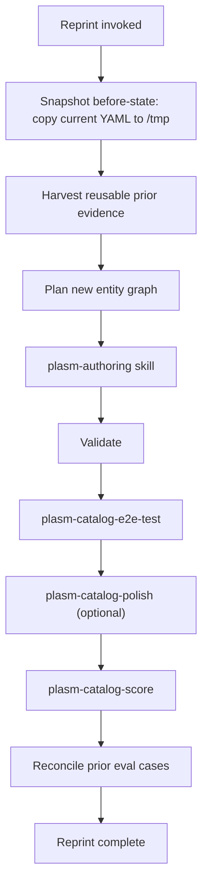

# Plasm Catalog Reprint

This skill performs a **full cutover** regeneration of an existing Plasm catalog. It is the correct response when [plasm-catalog-score](../plasm-catalog-score/SKILL.md) reports band D or F, or when [plasm-catalog-polish](../plasm-catalog-polish/SKILL.md) cannot fix structural problems without rewriting the entity graph.

The Tech-Priest doctrine on reprints: do not patch a corrupted machine-spirit with shims. Cleanse, re-author, re-validate. Preserve the lessons of the prior incarnation — never its corruption.

## When to run

- The catalog mirrors the RPC surface instead of a compressed domain.
- Entity boundaries are wrong (one entity per endpoint, or one entity smashing together two domain concepts).
- `entity_ref` is missing across the board and many `*_id` fields are stringly typed.
- The catalog was written against an old skill version and accumulated obsolete patterns (`output.type: none`, inline `field_type`, etc.).
- The user explicitly asks for a redo.

Do **not** run reprint when polish would do (incremental fixes to a structurally correct model).

## Inputs

- `apis/<api>/` — required.
- `apis/<api>/README.md` — read for scope, auth, OpenAPI source.
- Any existing `apis/<api>/eval/cases.yaml` — candidate for partial reuse.
- The OpenAPI spec, GraphQL SDL, or vendor docs the original used.
- Optional: user-provided scope ("just rewrite the read surface", "keep the same entity set but redo capabilities", "everything").

## Reprint principles

- **Preserve evidence, replace structure.** Eval goals that are still meaningful survive. `domain.yaml` does not.
- **No automatic transplant of capability names.** The new authoring pass may choose different capability ids if they read better as domain verbs.
- **Reuse the OpenAPI spec or SDL.** The wire is unchanged; what changes is the model layered over it.
- **Version bumps reset cleanly.** The reprinted catalog declares a fresh `version:` and increments from there.
- **Auth env vars stay the same** unless the vendor changed them. Reprint is not an excuse to invent new env names.

## Procedure



### Step 1: Snapshot the prior incarnation

Copy the current `domain.yaml`, `mappings.yaml`, `eval/cases.yaml`, and `README.md` to a scratch location outside the repo (e.g. `/tmp/plasm-reprint-<api>-<timestamp>/`). This preserves the prior model for reference during the rewrite without polluting the git history.

```bash
ts=$(date +%Y%m%d-%H%M%S)
mkdir -p /tmp/plasm-reprint-<api>-$ts
cp -r apis/<api>/ /tmp/plasm-reprint-<api>-$ts/
```

### Step 2: Harvest prior evidence

Read the snapshot and extract:

- Eval cases whose **goal text** describes a real agent task (these often survive even when capability ids change).
- README sections on scope, auth env vars, OpenAPI source path, sandbox info.
- Any helpful comments in `mappings.yaml` (vendor quirks, status code notes).
- Known capability gaps the prior model documented (deliberate omissions).

Discard:

- The entity layout itself (the model is what is being replaced).
- Capability ids (let the new authoring pass choose them fresh).
- `values:` keys (the registry rebuilds from scratch under the new entity boundaries).
- Stale scoring or polish notes that no longer apply.

### Step 3: Plan the new entity graph

Before writing any YAML, draft a short plan covering:

- **Task inventory** — user-language agent tasks (see [plasm-authoring — Task inventory](plasm-authoring/SKILL.md#step-15-task-inventory-before-entities)); each maps to `search`, `views:`, or write verbs.
- Entity list and one-line role for each.
- Relation graph (which entities reference which, scoped sub-resources, self-referential parents).
- Capability families per entity (`query`, `search`, `get`, write set, actions) — explicit list of **caps removed vs merged** from the prior model.
- Composed reads — if the README implies snapshot or summary concepts, plan a `views:` entry.
- Auth scheme (carried over unless the vendor changed it).
- Pagination shapes per list capability (from `mappings.yaml` in the spec).

This plan is short, in chat. It is **not** committed to the repo. It exists so the rewrite has a deliberate target rather than drifting back into RPC shapes. For issue trackers, use [Linear #1035](https://github.com/linear/linear/issues/1035) as the reference task shape (search, context, dashboard, manage) — not GraphQL operation names.

### Step 4: Author the new catalog

Hand control to [plasm-authoring](../plasm-authoring/SKILL.md). The authoring skill is the source of truth for CGS / CML rules. Reprint does not duplicate that doctrine; it ensures the authoring pass starts from a fresh slate.

Constraints during the authoring pass:

- Begin with the planned entity graph. Do **not** copy the old `domain.yaml` structure.
- Use top-level `values:` from the start.
- Mark `kind: action` outputs correctly (no `output.type: none`).
- Add `materialize` on parent relations for every scoped sub-resource URL.
- Add `views:` for composed reads instead of prose-only "use A then B" guidance.

### Step 5: Validate and transport-test

```bash
cargo run -p plasm-cli --bin plasm -- schema validate apis/<api>
cargo run -p plasm-cli --bin plasm -- validate --schema apis/<api> --spec path/to/openapi.json   # when available
```

Then run [plasm-catalog-e2e-test](../plasm-catalog-e2e-test/SKILL.md) at full ladder. A reprint without transport evidence is not a reprint, only a paper exercise.

### Step 6: Reconcile prior eval cases

Open the snapshot's `eval/cases.yaml` next to the freshly scaffolded `apis/<api>/eval/cases.yaml`:

```bash
cargo run -p plasm-eval -- scaffold --schema apis/<api> --write
```

For each old case:

- If the goal still maps onto the new entity / capability surface, port the case (rewriting `expect:` shapes to match the new symbols).
- If the goal no longer fits the new model, drop it and note why in the reprint summary.
- If the goal is still useful but the new model handles it more directly, simplify the case rather than translate literally.

Run coverage:

```bash
cargo run -p plasm-eval -- coverage --schema apis/<api> --cases apis/<api>/eval/cases.yaml
```

### Step 7: Optional polish and score

If anything is rough, run [plasm-catalog-polish](../plasm-catalog-polish/SKILL.md). Then [plasm-catalog-score](../plasm-catalog-score/SKILL.md) to confirm the reprint actually improved the rubric.

### Step 8: Reprint summary

Emit:

```
catalog: apis/<api>
prior version: <n>     (snapshot at /tmp/plasm-reprint-<api>-<ts>/)
new version: 1         (or whatever the fresh authoring chose)
prior band: <D | F>
new band: <A | B | C>

structural changes:
  - <high-level summary of new entity graph vs old>
  - <new relations and materialize blocks>
  - <new views:>
  - <auth changes if any>

eval cases:
  ported: <N>
  dropped: <M>      (reason per dropped case)
  added: <K>

transport evidence:
  hermit: <pass | fail | not applicable>
  live: <pass | fail | skipped>
  sandbox: <pass | fail | skipped>

candidates for retro:
  - <systemic gaps the reprint exposed>
```

## What reprint will not do

- Mechanically translate the old `domain.yaml` into a new one (that produces the same RPC shape with new field names).
- Preserve capability ids out of nostalgia. New names are fine if they read better.
- Skip transport tests because "we already tested the old catalog". A reprint is a new model and must be re-proven.
- Modify Plasm core crates. Core gaps go to a separate task.

## Handoff

- Successful reprint → optionally [plasm-catalog-score](../plasm-catalog-score/SKILL.md) to confirm band, then publish.
- Reprint exposed runtime / skill gaps → [plasm-catalog-retro](../plasm-catalog-retro/SKILL.md).
- The new model still scores low → reprint plan was wrong; revise the plan and re-author. Do not iterate on the wrong entity graph by polish.
