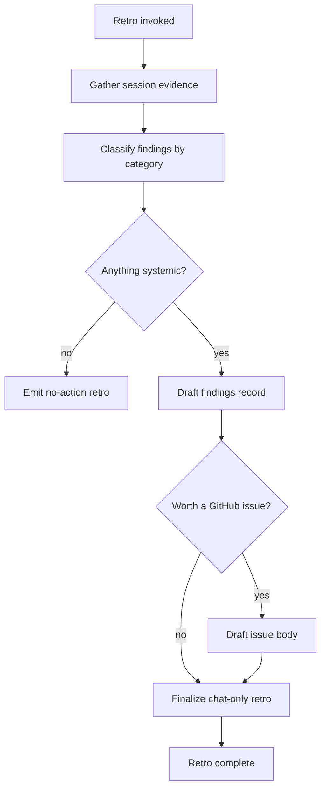

# Plasm Catalog Retrospective

This skill is the introspection rite. Catalogs are downstream artifacts; the **authoring pipeline** is upstream. When authoring a catalog reveals friction, missing expressiveness, ambiguous skill text, or a gap in fixtures / validators, retro captures that signal so the next catalog benefits.

Without retros, lessons stay implicit and the same friction surfaces forever.

## When to run

- After any [plasm-authoring](../plasm-authoring/SKILL.md), [plasm-catalog-polish](../plasm-catalog-polish/SKILL.md), or [plasm-catalog-reprint](../plasm-catalog-reprint/SKILL.md) session that touched a non-trivial catalog.
- After a low [plasm-catalog-score](../plasm-catalog-score/SKILL.md) result where the cause is **systemic**, not catalog-local.
- When the same friction has appeared in two or more catalogs in recent sessions.
- When the user asks for a retro explicitly.

Do not run retro for routine work that hit no friction. The point is to surface improvement opportunities, not generate paperwork.

## Inputs

- The most recent session's evidence: edits made, transport failures, scoring deltas, blockers raised.
- Recent `apis/` history: which catalogs were touched and what changed.
- Optional: a specific suspected gap the user wants probed.

## Categories of finding

Each finding is filed under one category. Categories help triage and keep the findings actionable.

### 1. Skill text gaps

- `plasm-authoring/SKILL.md` or `reference.md` was ambiguous, missing, or contradictory on a real authoring decision.
- The user had to ask for clarification because the doctrine did not cover their case.
- A pattern appeared often enough to deserve a named section but currently lives in prose only.

### 2. Runtime / language expressiveness

- The vendor API has a wire shape that CGS / CML / runtime cannot represent today without distortion.
- A capability semantic class is missing (e.g. partial updates that need explicit null, batched reads, RPC patterns the verb taxonomy does not cover).
- Pagination, hydration, or composed-read DAGs hit a real ceiling.

### 3. Validator coverage

- A bug or anti-pattern slipped through `schema validate`.
- `validate --spec` missed a real mapping drift.
- Eval coverage rules were too lax or too strict.

### 4. Fixture gaps

- Tests for a CGS / CML feature drive against a live `apis/` catalog when they should drive against `fixtures/schemas/` (per the strict rule in `AGENTS.md`).
- A new language feature was added without an entry in `plasm_language_matrix` / `plasm_language_matrix_views` / `plasm_prompt_matrix`.

### 5. Eval harness shortcomings

- `plasm-eval` coverage buckets do not match the real expression surface the catalog teaches.
- The harness lacks an adversarial case category that this catalog needed.
- Multi-step or pagination-intent cases are underrepresented.

### 6. Press tooling

- `plasm-eval scaffold`, `dedupe_primitive_domain_values.py`, Hermit invocations, or the validate CLI had rough edges that wasted authoring time.
- Cross-skill handoffs (authoring → polish → score → retro) were unclear.

### 7. Documentation drift

- A doc under `docs/` (or this skill suite) describes behavior the runtime no longer has, or omits behavior the runtime now has.
- README inventories under `apis/` disagree with reality.

## Procedure



### Step 1: Gather evidence

Pull from the current chat / session:

- Files touched and the reason.
- Errors hit (validation messages, decoder failures, eval bucket misses).
- Skill-doc references the user (or you) had to interpret.
- Blockers and how they were resolved (workarounds, user calls, abandoned paths).

For multi-session retros, also read recent commits in `apis/` and the relevant crates to detect recurring friction.

### Step 2: Classify

For every distinct friction, pick the smallest applicable category. Trivial points should be folded together; do not pad the retro.

### Step 3: Decide whether to emit a finding

A finding is worth filing only if at least one of the following is true:

- A future catalog will hit the same issue.
- A skill or doc change would have shortened the current session by more than a few minutes.
- A core gap blocked an authoring choice (not just made it tedious).
- A pattern recurred in this session or across recent sessions.

Otherwise log "no systemic findings" and move on.

### Step 4: Draft the findings record

Recommended shape:

```
retro for: apis/<api>   (or "multi-catalog session")
date: <ISO8601>
session summary: <one sentence>

findings:
  1. category: <skill text gaps | runtime | validator | fixtures | eval harness | press tooling | docs>
     severity: <low | medium | high>
     observation: <what was painful or wrong>
     evidence: <minimal reproducer or chat reference>
     proposed action: <concrete change to skill text, runtime, validator, fixture, etc.>
     owner candidate: <skill maintainer | plasm-core | plasm-eval | docs>

  2. ...

candidate github issues:
  - title: "<concise issue title>"
    body: |
      ...
```

### Step 5: Optional GitHub issue draft

When a finding is concrete enough, draft a GitHub issue body using the project's convention. Do **not** open the issue automatically — present the draft to the user for review and approval. Suggested body shape:

```markdown
## Context

<one paragraph: which catalog, what was being authored>

## Friction

<what was painful>

## Evidence

- <chat or commit reference>
- <minimal reproducer if applicable>

## Proposed change

- <concrete edit to skill text, validator, runtime, etc.>

## Why this matters

<which future catalogs benefit>
```

## What retro will not do

- Open issues without user approval.
- Modify `crates/plasm-*` or runtime behavior. Retro only records findings; implementation is a separate task with separate review.
- Reward verbosity. A short, accurate retro beats a long, noisy one.
- Substitute for [plasm-catalog-score](../plasm-catalog-score/SKILL.md) (which grades the catalog) or [plasm-catalog-polish](../plasm-catalog-polish/SKILL.md) (which fixes it).

## Handoff

- High-severity skill-text findings → propose edits to `skills/plasm-authoring/SKILL.md` or `reference.md` in a follow-up task.
- High-severity runtime findings → propose a separate `plasm-core` task; do not patch core in the same session.
- Validator / fixture findings → file against `crates/plasm-core` or `crates/plasm-e2e`.
- Doc drift → propose edits to `docs/` in a follow-up task.

Retros are most valuable when they are short, specific, and lead to one or two real edits over the following week. A retro that lists fifteen findings is rarely actioned. A retro that lists three is.
