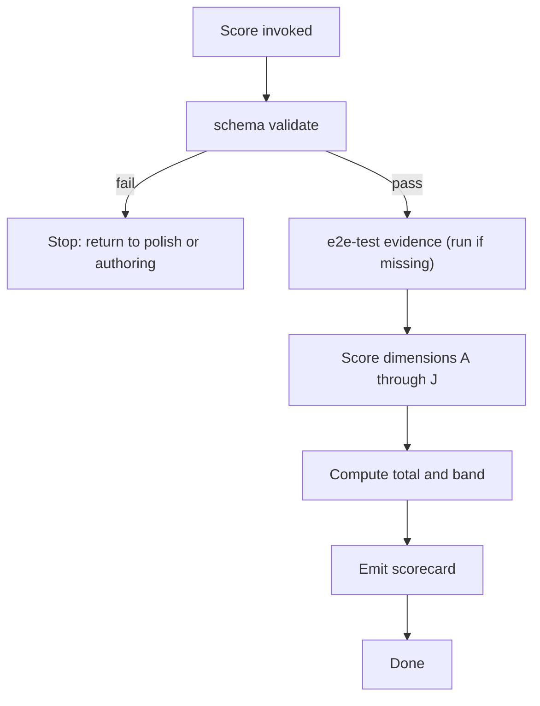

# Plasm Catalog Score

This skill grades a Plasm catalog against a fixed rubric and emits a scorecard. It is deterministic given the catalog state on disk — two runs on the same checkout produce the same score. Use it to decide whether a catalog is ready to publish, to compare alternatives, or to set a quality target.

## When to run

- After [plasm-catalog-polish](../plasm-catalog-polish/SKILL.md) reports all dimensions green.
- Periodically across the `apis/` tree to spot catalogs that have decayed.
- Before promoting a catalog from "experimental" to "trusted" in README inventories.
- When comparing two candidate models for the same API.

## Inputs

- `apis/<api>/` — required.
- Optional: a second catalog directory for side-by-side comparison.
- Optional: the most recent evidence record from [plasm-catalog-e2e-test](../plasm-catalog-e2e-test/SKILL.md). The skill re-runs e2e when none exists.

## Rubric

Each dimension is scored on a 0–4 scale. The catalog total is the sum (max 40).

| Dim | Dimension | 0 | 1 | 2 | 3 | 4 |
|----|-----------|---|---|---|---|---|
| A | Semantic compression | RPC-shaped — one capability per endpoint or GraphQL op, no merges | Some merges, but still mostly RPC | Domain entities exist, relations partial | Compressed, relations cover common navigation; primary filter via `search` | Task-shaped: capability set tracks user tasks and domain verbs, not paths or mutation list; issue trackers use search + context/dashboard views |
| B | Typed values | Most fields are `string` | Some `select` / `entity_ref` but many `_id` strings remain | Most FK fields typed, dates typed, enums typed | All FK fields typed, all dates typed, enums typed, `blob` used where appropriate | Strict typing checklist passes; `string_semantics` set on every non-trivial string |
| C | Relation utility | No relations | A few one-to-one relations | Many relations but no `materialize` for scoped sub-resources | All sub-resource URLs have `materialize`; reverse traversal works | Full relation graph including self-referential parents / children; `views:` for composed reads where the domain requires it |
| D | Action outputs | Several actions lack `provides:` or `output` | Some `output.description` is generic ("updates resource") | All actions declare projection or side-effect with specific description | Side-effect descriptions name the domain effect concretely | Side-effect descriptions are domain-accurate, projection-action `provides:` are exact subsets |
| E | Mappings completeness | Capabilities without mappings | All capabilities have mappings, but path / query / body drift | Mappings match spec for most ops | Mappings match spec for all ops; pagination declared where the API paginates | `validate --spec` passes; pagination, body formats, GraphQL variables all correct |
| F | Views usage | No `views:` even where the README implies composed reads | `views:` exist but only as documentation | A `views:` entry per composed read concept, with `transport: view` wired | `views:` cover all composed reads, with `relation_outputs:` for next-hop nav | Composed reads expose first-class `query` + `get` symbols; issue trackers include context + dashboard (or equivalent) views |
| G | Transport evidence | No evidence | Tier 0 only (schema validate) | Tier 1 (Hermit) passes | Tier 1 + Tier 2 (live) pass | Tier 1 + Tier 2 + Tier 3 (sandbox) pass for writes |
| H | Eval coverage | No `eval/cases.yaml` | Coverage fails (missing buckets) | Coverage passes with minimum cases | Coverage passes with adversarial cases included | Coverage passes with adversarial, multi-step, and pagination-intent cases |
| I | Description hygiene | Descriptions contain REST paths, status codes, bare URLs | Some clean descriptions, some stale | Most descriptions are domain-only | All descriptions are domain-only and agent-facing | Descriptions are concise, imperative, and never restate typed structure |
| J | README quality | Missing or stale | Lists commands only | Documents auth env vars and scope | Adds OpenAPI source path, sandbox info, known limitations | Full README: capability count, auth, OpenAPI source, sandbox info, limitations, example expressions |

### Bands

| Total | Band | Meaning |
|-------|------|---------|
| 36 – 40 | A | Reference catalog. Suitable for documentation examples. |
| 30 – 35 | B | Ship-ready. Trusted. |
| 22 – 29 | C | Useful but rough. Run `plasm-catalog-polish`. |
| 12 – 21 | D | Functional core but needs structural work. Consider polish or partial reprint. |
| 0 – 11  | F | Reauthor. Use `plasm-catalog-reprint` rather than incremental polish. |

## Procedure



### Step 1: Tier 0 gate

The catalog must pass `schema validate` before scoring. If it fails, return control to [plasm-catalog-polish](../plasm-catalog-polish/SKILL.md) or [plasm-authoring](../plasm-authoring/SKILL.md). A broken catalog cannot be graded.

### Step 2: Transport evidence

If no recent [plasm-catalog-e2e-test](../plasm-catalog-e2e-test/SKILL.md) record exists, run that skill first. Dimension G consumes its result.

### Step 3: Score each dimension

Walk `apis/<api>/domain.yaml`, `mappings.yaml`, `eval/cases.yaml`, and `README.md`. For each dimension, pick the highest tier whose criteria are fully met.

Programmatic checks that help (run as needed):

```bash
# Count capabilities, entities, relations
cargo run -p plasm-cli --bin plasm -- schema validate apis/<api>

# Spec drift signal (dimension E)
cargo run -p plasm-cli --bin plasm -- validate --schema apis/<api> --spec path/to/openapi.json

# Eval coverage (dimension H)
cargo run -p plasm-eval -- coverage --schema apis/<api> --cases apis/<api>/eval/cases.yaml
```

### Step 4: Emit scorecard

```
catalog: apis/<api>
domain version: <n>

A semantic compression:     <score>/4 - <one-line justification>
B typed values:             <score>/4 - ...
C relation utility:         <score>/4 - ...
D action outputs:           <score>/4 - ...
E mappings completeness:    <score>/4 - ...
F views usage:              <score>/4 - ...
G transport evidence:       <score>/4 - ...
H eval coverage:            <score>/4 - ...
I description hygiene:      <score>/4 - ...
J README quality:           <score>/4 - ...

total: <sum>/40
band: <A | B | C | D | F>

top three improvement targets:
  1. <dimension and concrete fix>
  2. ...
  3. ...
```

### Step 5: Comparison mode

When two catalogs are scored side-by-side, emit both scorecards followed by a delta table showing per-dimension differences and the recommended winner with reasoning.

## What score will not do

- Adjust the rubric to make a catalog look better.
- Reward elaborate descriptions; concise wins.
- Treat passing `schema validate` as proof of quality (it is necessary, not sufficient).
- Award Tier 2 / Tier 3 transport credit without actual evidence on disk or in chat.

## Handoff

- Band A or B → ready to publish or use as reference.
- Band C → [plasm-catalog-polish](../plasm-catalog-polish/SKILL.md).
- Band D → polish first, then re-score; if no improvement, consider partial reprint.
- Band F → [plasm-catalog-reprint](../plasm-catalog-reprint/SKILL.md).
- Repeated low scores across many catalogs in the same dimension → [plasm-catalog-retro](../plasm-catalog-retro/SKILL.md) to fix the underlying skill or runtime gap.
